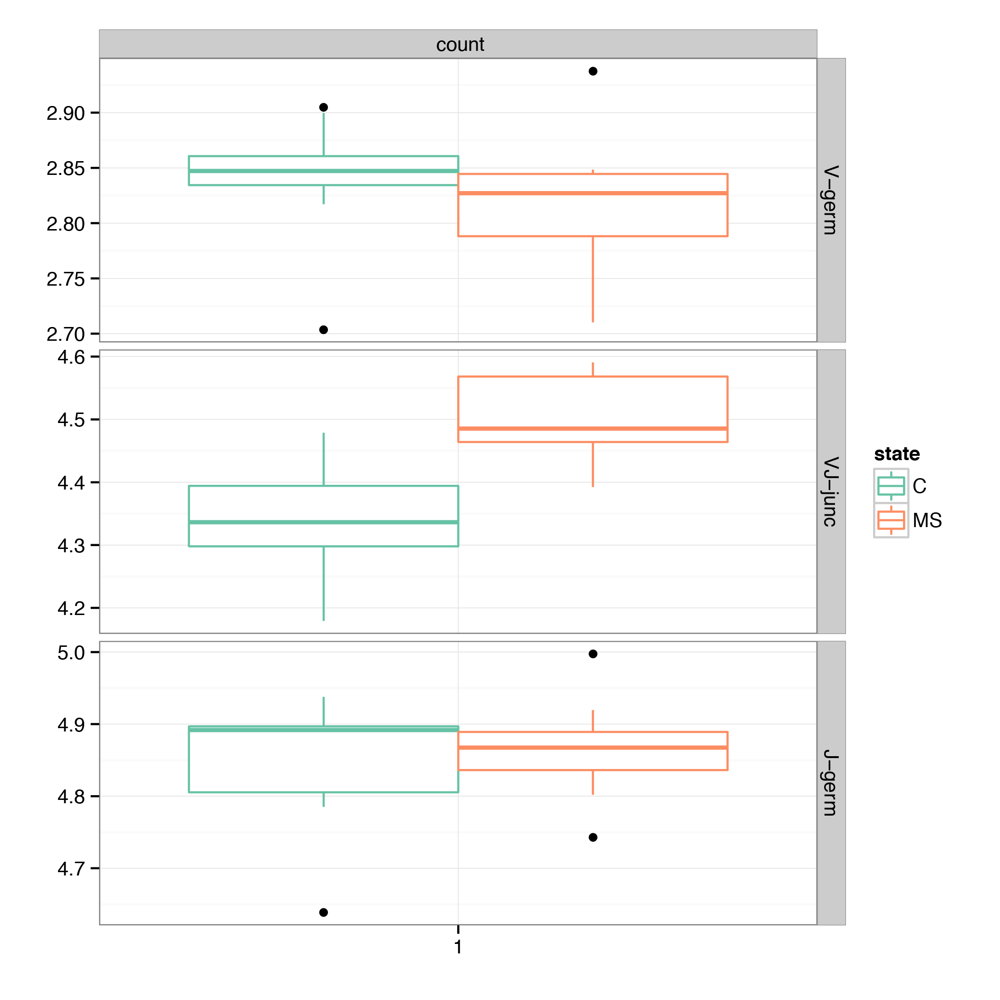

.. _annotate:

Annotation
----------

.. _CalcCdrAAProfile:

CalcCdrAAProfile
^^^^^^^^^^^^^^^^

Generates amino acid physical properties profile of CDR3. Amino acids are 
first grouped to corresponding CDR3 sub-regions and then binned by position 
within the sub-region. Amino acids in a given bin is scored according to 
its physical properties, sums of those scores and total number of amino acids
is reported for each sample/sub-region/bin/property combination.

For example under the **polarity** property amino acids are marked as polar (``1``) 
and non-polar (``0``) and the sum of these values is returned. When divided by 
the total number of amino acids one will get the fraction of polar amino acids 
in a given sample/sub-region. For **volume** the same operation will return the 
average volume of amino acids.

Command line usage
~~~~~~~~~~~~~~~~~~

.. code-block:: bash

    $VDJTOOLS CalcCdrAAProfile \
    [options] [sample1.txt sample2.txt ... if -m is not specified] output_prefix

Parameters:

+-------------+-----------------------+--------------------+------------------------------------------------------------------------------------------------------------------------------------------------------------+
| Shorthand   |      Long name        | Argument           | Description                                                                                                                                                |
+=============+=======================+====================+============================================================================================================================================================+
| ``-m``      | ``--metadata``        | path               | Path to metadata file. See :ref:`common_params`                                                                                                            |
+-------------+-----------------------+--------------------+------------------------------------------------------------------------------------------------------------------------------------------------------------+
| ``-u``      | ``--unweighted``      |                    | If set, will not weight amino acid physical property averages by clonotype frequency. Weighing is performed by default.                                    |
+-------------+-----------------------+--------------------+------------------------------------------------------------------------------------------------------------------------------------------------------------+
| ``-p``      | ``--plot``            |                    | Turns on plotting. See :ref:`common_params`                                                                                                                |
+-------------+-----------------------+--------------------+------------------------------------------------------------------------------------------------------------------------------------------------------------+
|             | ``--plot-normalized`` |                    | Will normalize amino acid statistic values by dividing them by the total number of amino acids in a given bin when generating the figure                   |
+-------------+-----------------------+--------------------+------------------------------------------------------------------------------------------------------------------------------------------------------------+
| ``-f``      | ``--factor``          | string             | Specifies plotting factor. See :ref:`common_params`                                                                                                        |
+-------------+-----------------------+--------------------+------------------------------------------------------------------------------------------------------------------------------------------------------------+
| ``-r``      | ``--region-list``     | region1:nbins1,... | Comma-separated list of ``region:bin`` pairs: CDR3 sub-region (see below) and the number of length bins. Default: ``CDR3-full:1,VJ-junc:1,CDR3-center:1``  |
+-------------+-----------------------+--------------------+------------------------------------------------------------------------------------------------------------------------------------------------------------+
| ``-o``      | ``--property-list``   | property1,...      | List of amino acid physical properties to use, see below for allowed value. Uses all amino acid properties from list below by default.                     |
+-------------+-----------------------+--------------------+------------------------------------------------------------------------------------------------------------------------------------------------------------+
|             | ``--include-cfw``     |                    | Consider first and last AAs of CDR3, which are normally conserved C and F/W. By default those are discarded.                                               |
+-------------+-----------------------+--------------------+------------------------------------------------------------------------------------------------------------------------------------------------------------+
| ``-h``      | ``--help``            |                    | Display help message                                                                                                                                       |
+-------------+-----------------------+--------------------+------------------------------------------------------------------------------------------------------------------------------------------------------------+

Supported CDR3 sub-regions:

+-----------------+--------------------------------------------------------------------------+
| Name            | Description                                                              |
+=================+==========================================================================+
| ``CDR3-full``   | Complete CDR3 region                                                     |
+-----------------+--------------------------------------------------------------------------+
| ``CDR3-center`` | Central 3 amino acids of CDR3                                            |
+-----------------+--------------------------------------------------------------------------+
| ``V-germ``      | Germline part of CDR3 region corresponding to Variable segment           |
+-----------------+--------------------------------------------------------------------------+
| ``D-germ``      | Germline part of CDR3 region corresponding to Diversity segment          |
+-----------------+--------------------------------------------------------------------------+
| ``J-germ``      | Germline part of CDR3 region corresponding to Joining segment            |
+-----------------+--------------------------------------------------------------------------+
| ``VD-junc``     | Variable-Diversity segment junction, applicable when D segment is mapped |
+-----------------+--------------------------------------------------------------------------+
| ``DJ-junc``     | Diversity-Joining segment junction, applicable when D segment is mapped  |
+-----------------+--------------------------------------------------------------------------+
| ``VJ-junc``     | Variable-Joining segment junction, including D segment if it is mapped   |
+-----------------+--------------------------------------------------------------------------+

Supported amino acid physical properties (see `full table <https://github.com/mikessh/vdjtools/blob/master/src/main/resources/profile/aa_property_table.txt>`__ for raw values):

+-------------------+-----------------------------------------------------------------------------------------------------------------+-----------------------------------------------------------------+
| Name              | Description                                                                                                     | Reference                                                       |
+===================+=================================================================================================================+=================================================================+
| ``alpha``         | Preference to appear in alpha helices                                                                           | Stryer L et al. Biochemistry, 5th edition. ISBN 978-0716746843  |
+-------------------+-----------------------------------------------------------------------------------------------------------------+-----------------------------------------------------------------+
| ``beta``          | Preference to appear in beta sheets                                                                             | Stryer L et al. Biochemistry, 5th edition. ISBN 978-0716746843  |
+-------------------+-----------------------------------------------------------------------------------------------------------------+-----------------------------------------------------------------+
| ``turn``          | Preference to appear in turns                                                                                   | Stryer L et al. Biochemistry, 5th edition. ISBN 978-0716746843  |
+-------------------+-----------------------------------------------------------------------------------------------------------------+-----------------------------------------------------------------+
| ``surface``       | Residues that have unchanged accessibility area when PPI partner is present                                     | `PMID:22559010 <http://www.ncbi.nlm.nih.gov/pubmed/22559010>`__ |
+-------------------+-----------------------------------------------------------------------------------------------------------------+-----------------------------------------------------------------+
| ``rim``           | Residues that have changed accessibility area, but no atoms with zero accessibility in PPI interfaces           | `PMID:22559010 <http://www.ncbi.nlm.nih.gov/pubmed/22559010>`__ |
+-------------------+-----------------------------------------------------------------------------------------------------------------+-----------------------------------------------------------------+
| ``core``          | Residues that have changed accessibility area and at least one atom with zero accessibility in PPI interfaces   | `PMID:22559010 <http://www.ncbi.nlm.nih.gov/pubmed/22559010>`__ |
+-------------------+-----------------------------------------------------------------------------------------------------------------+-----------------------------------------------------------------+
| ``disorder``      | Intrinsic structural disorder-promoting, order-promoting and neutral amino acids                                | `PMID:11381529 <http://www.ncbi.nlm.nih.gov/pubmed/11381529>`__ |
+-------------------+-----------------------------------------------------------------------------------------------------------------+-----------------------------------------------------------------+
| ``charge``        | Charged/non-charged amino acids                                                                                 | `Wikipedia <https://en.wikipedia.org/wiki/Amino_acid>`__        |
+-------------------+-----------------------------------------------------------------------------------------------------------------+-----------------------------------------------------------------+
| ``pH``            | Amino acid pH level                                                                                             | `Wikipedia <https://en.wikipedia.org/wiki/Amino_acid>`__        |
+-------------------+-----------------------------------------------------------------------------------------------------------------+-----------------------------------------------------------------+
| ``polarity``      | Polar/non-polar amino acids                                                                                     | `Wikipedia <https://en.wikipedia.org/wiki/Amino_acid>`__        |
+-------------------+-----------------------------------------------------------------------------------------------------------------+-----------------------------------------------------------------+
| ``hydropathy``    | Amino acid hydropathy                                                                                           | `Wikipedia <https://en.wikipedia.org/wiki/Amino_acid>`__        |
+-------------------+-----------------------------------------------------------------------------------------------------------------+-----------------------------------------------------------------+
| ``volume``        | Amino acid volume                                                                                               | `Wikipedia <https://en.wikipedia.org/wiki/Amino_acid>`__        |
+-------------------+-----------------------------------------------------------------------------------------------------------------+-----------------------------------------------------------------+
| ``strength``      | Strongly-interacting amino acids / amino acids depleted by purifying selection in thymus                        | `PMID:18946038 <http://www.ncbi.nlm.nih.gov/pubmed/18946038>`__ |
+-------------------+-----------------------------------------------------------------------------------------------------------------+-----------------------------------------------------------------+
| ``high_contact``  | Amino acids that show high antigen contact frequencies as inferred from TCR:pMHC structural data                | unpublished                                                     |
+-------------------+-----------------------------------------------------------------------------------------------------------------+-----------------------------------------------------------------+
| ``contacts_raw``  | Number of antigen contacts for given CDR3 amino acid as inferred from TCR:pMHC structural data                  | unpublished                                                     |
+-------------------+-----------------------------------------------------------------------------------------------------------------+-----------------------------------------------------------------+
| ``contacts_norm`` | Normalized number of antigen contacts for given CDR3 amino acid as inferred from TCR:pMHC structural data       | unpublished                                                     |
+-------------------+-----------------------------------------------------------------------------------------------------------------+-----------------------------------------------------------------+

.. note:: 
    
    Consider an example binning scheme, ``-r V-germ:3,VJ-junc:1,J-germ:3``.
    It means that the amino acid sequence of Variable segment part of CDR3 is split into 
    3 equally-sized bins and so on.    
    This can be changed to ``-r V-germ:3,VD-junc:1,D-germ:1,DJ-junc:1,J-germ:3`` for 
    analysis of chains that have Diversity segment (TRB, TRD, IGH).
    In case of very small average insert size (short V-J junction), one should consider 
    using a single bin for this sub-region, ``VJ-junc:1``.
    
Tabular output
~~~~~~~~~~~~~~

A summary table with averaged amino acid property values is generated, 
suffixed ``cdr3aa.profile.[wt or unwt based on -u].txt``. The table contains 
the following columns:

+---------------+---------------------------------------------------------------------------------------------------------------+
| Column        | Description                                                                                                   |
+===============+===============================================================================================================+
| sample\_id    | Sample unique identifier                                                                                      |
+---------------+---------------------------------------------------------------------------------------------------------------+
| ...           | Sample metadata columns. See `Metadata <https://github.com/mikessh/vdjtools/wiki/Input#metadata>`__ section   |
+---------------+---------------------------------------------------------------------------------------------------------------+
| cdr3.segment  | Current CDR3 sub-region, see above                                                                            |
+---------------+---------------------------------------------------------------------------------------------------------------+
| bin           | Length bin within `cdr3.segment`                                                                              |
+---------------+---------------------------------------------------------------------------------------------------------------+
| property      | Amino acid physical property name, see above                                                                  |
+---------------+---------------------------------------------------------------------------------------------------------------+
| value         | Sum of amino acid property values in the bin, either weighted by clonotype frequency or not depending on `-u` |
+---------------+---------------------------------------------------------------------------------------------------------------+
| total         | Sum of amino acid counts in the bin, either weighted by clonotype frequency or not depending on `-u`          |
+---------------+---------------------------------------------------------------------------------------------------------------+
| sd            | Standard deviation of the value                                                                               |
+---------------+---------------------------------------------------------------------------------------------------------------+

Graphical output
~~~~~~~~~~~~~~~~

A plot file with ``cdr3aa.profile.[wt or unwt based on -u].pdf`` suffix is generated. 
Rows and columns correspond to amino acid properties and CDR3 sub-regions respectively. 
Normalized values (``value``/``total`` from output table) are grouped by specified factor (``-f``).

    
**Amino acid hydrophathy and strength profiles**. Germline CDR3 parts corresponding 
to V, D and J segments are used (4, 4 and 2 length bins respectively), 
as well as V-D and D-J junctions (1 length bin respectively). 

--------------

.. _Annotate2:

Annotate
^^^^^^^^

This routine will compute a set of properties for each clonotype's CDR3 sequence and 
append them to resulting clonotype table. For example, number of added N-nucleotides 
and the sum of polar amino acids in CDR3. The main difference from :ref:`CalcCdrAAProfile` 
is that the former computes sample-level average while this routine performs calculation 
on clonotype level.

Command line usage
~~~~~~~~~~~~~~~~~~

.. code-block:: bash

    $VDJTOOLS Annotate \
    [options] [sample1.txt sample2.txt ... if -m is not specified] output_prefix

Parameters:

+-------------+-----------------------+--------------------+---------------------------------------------------------------------------------------------------------------------------------------------------------------------------------------------------------------------------------------------------------------------------+
| Shorthand   |      Long name        | Argument           | Description                                                                                                                                                                                                                                                               |
+=============+=======================+====================+===========================================================================================================================================================================================================================================================================+
| ``-m``      | ``--metadata``        | path               | Path to metadata file. See :ref:`common_params`                                                                                                                                                                                                                           |
+-------------+-----------------------+--------------------+---------------------------------------------------------------------------------------------------------------------------------------------------------------------------------------------------------------------------------------------------------------------------+
| ``-b``      | ``--base``            | param1,param2,...  | Comma-separated list of basic clonotype features to calculate and append to resulting clonotype tables. See below for allowed values. Default: ``cdr3Length,ndnSize,insertSize``                                                                                          |
+-------------+-----------------------+--------------------+---------------------------------------------------------------------------------------------------------------------------------------------------------------------------------------------------------------------------------------------------------------------------+
| ``-a``      | ``--aaprop``          | property1,...      | Comma-separated list of amino acid properties. Amino acid property value sum will be calculated for CDR3 sequence (blank annotations will be generated for non-coding clonotypes). See below for allowed values. Default: ``hydropathy,charge,polarity,strength,contact`` |
+-------------+-----------------------+--------------------+---------------------------------------------------------------------------------------------------------------------------------------------------------------------------------------------------------------------------------------------------------------------------+
| ``-h``      | ``--help``            |                    | Display help message                                                                                                                                                                                                                                                      |
+-------------+-----------------------+--------------------+---------------------------------------------------------------------------------------------------------------------------------------------------------------------------------------------------------------------------------------------------------------------------+

List of basic annotation properties:

+----------------+--------------------------------------------------------------------------------------------------+
| Name           | Description                                                                                      |
+================+==================================================================================================+
| ``cdr3Length`` | Length of CDR3 region                                                                            |
+----------------+--------------------------------------------------------------------------------------------------+
| ``NDNSize``    | Number of nucleotides between last base of V germline and first base of J germline parts of CDR3 |
+----------------+--------------------------------------------------------------------------------------------------+
| ``insertSize`` | Number of added N-nucleotides                                                                    |
+----------------+--------------------------------------------------------------------------------------------------+
| ``VDIns``      | Number of added N-nucleotides in V-D junction or ``-1`` if D segment is undefined                |
+----------------+--------------------------------------------------------------------------------------------------+
| ``DJIns``      | Number of added N-nucleotides in D-J junction or ``-1`` if D segment is undefined                |
+----------------+--------------------------------------------------------------------------------------------------+

See :ref:`CalcCdrAAProfile` for the list of amino acid properties available for annotation. 
Sum of specified amino acid property values across all amino acids of CDR3 will be computed. 
It can be divided by ``cdr3Length / 3`` basic property value to get the average.
    
Tabular output
~~~~~~~~~~~~~~

Processed samples will have additional annotation columns appended to VDJtools clonotype 
table columns. Those columns will be prefixed with ``base.`` for basic CDR3 properties 
and ``aaprop.`` for CDR3 amino acid composition properties.

A metadata file will be created for resulting samples with ``annot:[-b value]:[-a value]`` 
appended to the ``..filter..`` metadata column.

Graphical output
~~~~~~~~~~~~~~~~

none

----------------

.. _ScanDatabase:

ScanDatabase (Available only up to v1.0.5, use `VDJdb <https://github.com/mikessh/vdjdb>`__)
^^^^^^^^^^^^^^^^^^^^^^^^^^^^^^^^^^^^^^^^^^^^^^^^^^^^^^^^^^^^^^^^^^^^^^^^^^^^^^^^^^^^^^^^^^^^

Annotates a set of samples using immune receptor database based on
V-(D)-J junction matching. By default uses
`VDJdb <https://github.com/mikessh/vdjdb>`__, which contains CDR3
sequences, Variable and Joining segments of known specificity obtained
using literature mining. This routine supports user-provided databases
and allows flexible filtering of results based on database fields. The
output of ScanDatabase includes both detailed (clonotype-wise)
annotation of samples and summary statistics. Only amino-acid CDR3
sequences are used in database querying.

Command line usage
~~~~~~~~~~~~~~~~~~

.. code-block:: bash

    $VDJTOOLS ScanDatabase \
    [options] [sample1.txt sample2.txt ... if -m is not specified] output_prefix

Parameters:

+-------------+-----------------------+------------------+-----------------------------------------------------------------------------------------------------------------------------------------------------------------------------------+
| Shorthand   |      Long name        | Argument         | Description                                                                                                                                                                       |
+=============+=======================+==================+===================================================================================================================================================================================+
| ``-m``      | ``--metadata``        | path             | Path to metadata file. See :ref:`common_params`                                                                                                                                   |
+-------------+-----------------------+------------------+-----------------------------------------------------------------------------------------------------------------------------------------------------------------------------------+
| ``-D``      | ``--database``        | path             | Path to an external database file. Will use built-in VDJdb if not specified.                                                                                                      |
+-------------+-----------------------+------------------+-----------------------------------------------------------------------------------------------------------------------------------------------------------------------------------+
| ``-d``      | ``--details``         |                  | Will provide a detailed output for each sample with annotated clonotype matches                                                                                                   |
+-------------+-----------------------+------------------+-----------------------------------------------------------------------------------------------------------------------------------------------------------------------------------+
| ``-f``      | ``--fuzzy``           |                  | Will query database allowing at most 2 substitutions, 1 deletion and 1 insertion but no more than 2 mismatches simultaneously. If not set, only exact matches will be reported    |
+-------------+-----------------------+------------------+-----------------------------------------------------------------------------------------------------------------------------------------------------------------------------------+
|             | ``--filter``          | ``expression``   | Logical pre-filter on database columns. See below                                                                                                                                 |
+-------------+-----------------------+------------------+-----------------------------------------------------------------------------------------------------------------------------------------------------------------------------------+
|             | ``--v-match``         |                  | V segment must to match                                                                                                                                                           |
+-------------+-----------------------+------------------+-----------------------------------------------------------------------------------------------------------------------------------------------------------------------------------+
|             | ``--j-match``         |                  | J segment must to match                                                                                                                                                           |
+-------------+-----------------------+------------------+-----------------------------------------------------------------------------------------------------------------------------------------------------------------------------------+
| ``-h``      | ``--help``            |                  | Display help message                                                                                                                                                              |
+-------------+-----------------------+------------------+-----------------------------------------------------------------------------------------------------------------------------------------------------------------------------------+

.. note:: 
    
    Database filter is a logical expression that contains
    reference to input table columns. Database column name references should 
    be surrounded with double underscores (``__``). Syntax supports Regex and 
    standard Java/Groovy functions such as ``.contains()``, ``.startsWith()``, 
    etc. Here are some examples:
    
    .. code-block:: groovy    
        
        __origin__=~/EBV/
        !(__origin__=~/CMV/)
        
    Note that the expression should be quoted: ``--filter "__origin__=~/HSV/"``

Tabular output
~~~~~~~~~~~~~~

A summary table suffixed ``annot.[database name].summary.txt`` is
generated. First header line marked with ``##FILTER`` contains filtering
expression that was used. The table contains the following columns:

+----------------------------------+--------------------------------------------------------------------------------------------------------------------------------------------------------------------------------------------------------------------------------------------------------------------------------------------------+
| Column                           | Description                                                                                                                                                                                                                                                                                      |
+==================================+==================================================================================================================================================================================================================================================================================================+
| sample\_id                       | Sample unique identifier                                                                                                                                                                                                                                                                         |
+----------------------------------+--------------------------------------------------------------------------------------------------------------------------------------------------------------------------------------------------------------------------------------------------------------------------------------------------+
| ...                              | Sample metadata columns. See `Metadata <https://github.com/mikessh/vdjtools/wiki/Input#metadata>`__ section                                                                                                                                                                                      |
+----------------------------------+--------------------------------------------------------------------------------------------------------------------------------------------------------------------------------------------------------------------------------------------------------------------------------------------------+
| diversity                        | Number of clonotypes in sample                                                                                                                                                                                                                                                                   |
+----------------------------------+--------------------------------------------------------------------------------------------------------------------------------------------------------------------------------------------------------------------------------------------------------------------------------------------------+
| match\_size                      | Number of matches between sample and database. In case ``--fuzzy`` mode is on, all matches will be counted. E.g. if clonotype ``a`` in the sample matches clonotypes ``A`` and ``B`` in the database and clonotype ``b`` in the sample matches clonotype B the value in this column will be 3.   |
+----------------------------------+--------------------------------------------------------------------------------------------------------------------------------------------------------------------------------------------------------------------------------------------------------------------------------------------------+
| sample\_diversity\_in\_matches   | Number of unique clonotypes in the sample that matched clonotypes from the database                                                                                                                                                                                                              |
+----------------------------------+--------------------------------------------------------------------------------------------------------------------------------------------------------------------------------------------------------------------------------------------------------------------------------------------------+
| db\_diversity\_in\_matches       | Number of unique clonotypes in the database that matched clonotypes from the sample                                                                                                                                                                                                              |
+----------------------------------+--------------------------------------------------------------------------------------------------------------------------------------------------------------------------------------------------------------------------------------------------------------------------------------------------+
| sample\_freq\_in\_matches        | Overall frequency of unique clonotypes in the sample that matched clonotypes from the database                                                                                                                                                                                                   |
+----------------------------------+--------------------------------------------------------------------------------------------------------------------------------------------------------------------------------------------------------------------------------------------------------------------------------------------------+
| mean\_matched\_clone\_size       | Geometric mean of frequency of unique clonotypes in the sample that matched clonotypes from the database                                                                                                                                                                                         |
+----------------------------------+--------------------------------------------------------------------------------------------------------------------------------------------------------------------------------------------------------------------------------------------------------------------------------------------------+

Detailed database query results will be also reported for each sample if
``-d`` is specified. Those tables are suffixed
``annot.[database name].[sample id].txt`` and contain the following
columns.

+-------------------+-----------------------------------------------------------------------+
| Column            | Description                                                           |
+===================+=======================================================================+
| score             | CDR3 sequence alignment score                                         |
+-------------------+-----------------------------------------------------------------------+
| query\_cdr3aa     | Query CDR3 amino acid sequence                                        |
+-------------------+-----------------------------------------------------------------------+
| query\_v          | Query Variable segment                                                |
+-------------------+-----------------------------------------------------------------------+
| query\_j          | Query Joining segment                                                 |
+-------------------+-----------------------------------------------------------------------+
| subject\_cdr3aa   | Subject CDR3 amino acid sequence                                      |
+-------------------+-----------------------------------------------------------------------+
| subject\_v        | Subject Variable segment                                              |
+-------------------+-----------------------------------------------------------------------+
| subject\_j        | Subject Joining segment                                               |
+-------------------+-----------------------------------------------------------------------+
| v\_match          | ``true`` if Variable segments of query and subject clonotypes match   |
+-------------------+-----------------------------------------------------------------------+
| j\_match          | ``true`` if Joining segments of query and subject clonotypes match    |
+-------------------+-----------------------------------------------------------------------+
| mismatches        | Comma-separated list of query->subject mismatches                     |
+-------------------+-----------------------------------------------------------------------+
| ...               | Database fields corresponding to subject clonotype                    |
+-------------------+-----------------------------------------------------------------------+

Graphical output
~~~~~~~~~~~~~~~~

none