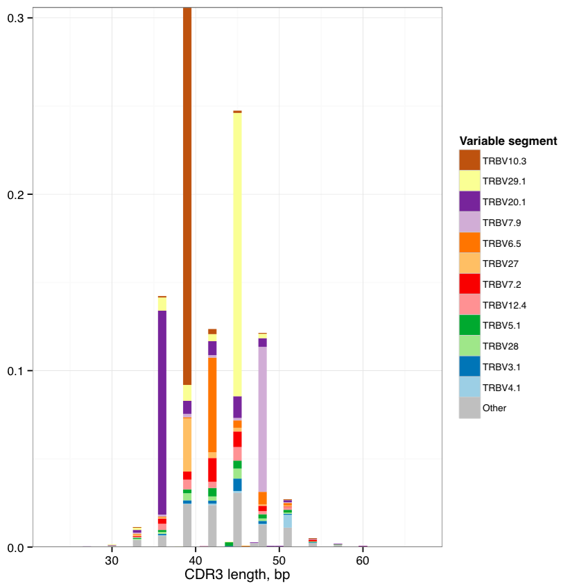

.. _basic:

Basic analysis
--------------

.. _CalcBasicStats:

CalcBasicStats
^^^^^^^^^^^^^^

This routine computes a set of basic sample statistics, such as read
counts, number of clonotypes, etc.

Command line usage
~~~~~~~~~~~~~~~~~~

.. code-block:: bash

    $VDJTOOLS CalcBasicStats \
    [options] [sample1.txt sample2.txt ... if -m is not specified] output_prefix

Parameters:

+-------------+-----------------------+------------+--------------------------------------------------------------------+
| Shorthand   |      Long name        | Argument   | Description                                                        |
+=============+=======================+============+====================================================================+
| ``-m``      | ``--metadata``        | path       | Path to metadata file. See :ref:`common_params`                    |
+-------------+-----------------------+------------+--------------------------------------------------------------------+
| ``-u``      | ``--unweighted``      |            | If not set, all statistics will be weighted by clonotype frequency |
+-------------+-----------------------+------------+--------------------------------------------------------------------+
| ``-h``      | ``--help``            |            | Display help message                                               |
+-------------+-----------------------+------------+--------------------------------------------------------------------+

Tabular output
~~~~~~~~~~~~~~

The following table with ``.basicstats.txt`` suffix is generated,

+------------------------+--------------------------------------------------------------------------------------------------------------------------------------------------------------------+
| Column                 | Description                                                                                                                                                        |
+========================+====================================================================================================================================================================+
| sample\_id             | Sample unique identifier                                                                                                                                           |
+------------------------+--------------------------------------------------------------------------------------------------------------------------------------------------------------------+
| ...                    | Metadata columns. See :ref:`metadata` section                                                                                                                      |
+------------------------+--------------------------------------------------------------------------------------------------------------------------------------------------------------------+
| count                  | Number of reads in a given sample                                                                                                                                  |
+------------------------+--------------------------------------------------------------------------------------------------------------------------------------------------------------------+
| diversity              | Number of clonotypes in a given sample                                                                                                                             |
+------------------------+--------------------------------------------------------------------------------------------------------------------------------------------------------------------+
| mean\_frequency        | Mean clonotype frequency                                                                                                                                           |
+------------------------+--------------------------------------------------------------------------------------------------------------------------------------------------------------------+
| geomean\_frequency     | Geometric mean of clonotype frequency                                                                                                                              |
+------------------------+--------------------------------------------------------------------------------------------------------------------------------------------------------------------+
| nc\_diversity          | Number of non-coding clonotypes                                                                                                                                    |
+------------------------+--------------------------------------------------------------------------------------------------------------------------------------------------------------------+
| nc\_frequency          | Frequency of reads that belong to non-coding clonotypes                                                                                                            |
+------------------------+--------------------------------------------------------------------------------------------------------------------------------------------------------------------+
| mean\_cdr3nt\_length   | Mean length of CDR3 nucleotide sequence. Weighted by clonotype frequency                                                                                           |
+------------------------+--------------------------------------------------------------------------------------------------------------------------------------------------------------------+
| mean\_insert\_size     | Mean number of inserted random nucleotides in CDR3 sequence. Characterizes V-J insert for receptor chains without D segment, or a sum of V-D and D-J insert sizes  |
+------------------------+--------------------------------------------------------------------------------------------------------------------------------------------------------------------+
| mean\_ndn\_size        | Mean number of nucleotides that lie between V and J segment sequences in CDR3                                                                                      |
+------------------------+--------------------------------------------------------------------------------------------------------------------------------------------------------------------+
| convergence            | Mean number of unique CDR3 nucleotide sequences that code for the same CDR3 amino acid sequence                                                                    |
+------------------------+--------------------------------------------------------------------------------------------------------------------------------------------------------------------+

Graphical output
~~~~~~~~~~~~~~~~

none

--------------

.. _CalcSegmentUsage:

CalcSegmentUsage
^^^^^^^^^^^^^^^^

This routine computes Variable (V) and Joining (J) segment usage
vectors, i.e. the frequency of associated reads for each of V/J segments
present in sample(s). If plotting is on, will also perform clustering
for V/J usage vectors and samples *à la* gene expression analysis.

Command line usage
~~~~~~~~~~~~~~~~~~

.. code-block:: bash

    $VDJTOOLS CalcSegmentUsage \
    [options] [sample1.txt sample2.txt ... if -m is not specified] output_prefix

Parameters:

+-------------+-----------------------+------------+-------------------------------------------------------------------------------------------------------------+
| Shorthand   |      Long name        | Argument   | Description                                                                                                 |
+=============+=======================+============+=============================================================================================================+
| ``-m``      | ``--metadata``        | path       | Path to metadata file. See :ref:`common_params`                                                             |
+-------------+-----------------------+------------+-------------------------------------------------------------------------------------------------------------+
| ``-u``      | ``--unweighted``      |            | Will compute the number of unique clonotypes with a given V/J segment. Counts the number of reads otherwise |
+-------------+-----------------------+------------+-------------------------------------------------------------------------------------------------------------+
| ``-p``      | ``--plot``            |            | Turns on plotting. See :ref:`common_params`                                                                 |
+-------------+-----------------------+------------+-------------------------------------------------------------------------------------------------------------+
| ``-f``      | ``--factor``          | string     | Specifies plotting factor. See :ref:`common_params`                                                         |
+-------------+-----------------------+------------+-------------------------------------------------------------------------------------------------------------+
| ``-n``      | ``--numeric``         |            | Specifies if plotting factor is numeric. See :ref:`common_params`                                           |
+-------------+-----------------------+------------+-------------------------------------------------------------------------------------------------------------+
| ``-l``      | ``--label``           | string     | Specifies label used for plotting. See :ref:`common_params`                                                 |
+-------------+-----------------------+------------+-------------------------------------------------------------------------------------------------------------+
| ``-h``      | ``--help``            |            | Display help message                                                                                        |
+-------------+-----------------------+------------+-------------------------------------------------------------------------------------------------------------+

Tabular output
~~~~~~~~~~~~~~

The following tables with
``.segments.[unwt or wt depending on -u parameter].[V or J].txt`` suffix
are generated,

+-----------------------------------+------------------------------------------------+
| Column                            | Description                                    |
+===================================+================================================+
| sample\_id                        | Sample unique identifier                       |
+-----------------------------------+------------------------------------------------+
| ...                               | Metadata columns. See :ref:`metadata` section  |
+-----------------------------------+------------------------------------------------+
| Segment name, e.g. TRBJ1-1        | Segment frequency in a given sample            |
+-----------------------------------+------------------------------------------------+
| Next segment name, e.g. TRBJ1-2   | ...                                            |
+-----------------------------------+------------------------------------------------+
| ...                               | ...                                            |
+-----------------------------------+------------------------------------------------+

Graphical output
~~~~~~~~~~~~~~~~

Images, having the same name as tables, with the exception of ``.pdf``
extension, are created if plotting is on. They display segment usage
heatmap and hierarchical clustering for samples and segment.

This figure will be created using `heatmap.2` function from 
`gplots <http://cran.r-project.org/web/packages/gplots/>`__ R package
with default clustering parameters.

.. figure:: _static/images/modules/basic-segmentusage.png
    :align: center
    :scale: 50 %
    
**Sample clustering based on Variable segment usage**. Weighted 
Variable usage profiles are used, hierarchical clustering is
performed using euclidean distance. A continuous factor is displayed 
(``-n -f age`` argument).

--------------

.. _CalcSpectratype:

CalcSpectratype
^^^^^^^^^^^^^^^

Calculates
`spectratype <http://www.jimmunol.org/content/152/10/5109.full.pdf+html>`__,
that is, histogram of read counts by CDR3 nucleotide length. The
spectratype is useful to detect pathological and highly clonal
repertoires, as the spectratype of non-expanded T- and B-cells has a
symmetric gaussian-like distribution.

Command line usage
~~~~~~~~~~~~~~~~~~

.. code-block:: bash

    $VDJTOOLS CalcSpectratype \
    [options] [sample1.txt sample2.txt ... if -m is not specified] output_prefix

Parameters:

+-------------+-----------------------+------------+-------------------------------------------------------------------------------------------------------------------------+
| Shorthand   |      Long name        | Argument   | Description                                                                                                             |
+=============+=======================+============+=========================================================================================================================+
| ``-m``      | ``--metadata``        | path       | Path to metadata file. See :ref:`common_params`                                                                         |
+-------------+-----------------------+------------+-------------------------------------------------------------------------------------------------------------------------+
| ``-u``      | ``--unweighted``      |            | Instead of computing read frequency, will compute the number of unique clonotypes with specific a CDR3 length           |
+-------------+-----------------------+------------+-------------------------------------------------------------------------------------------------------------------------+
| ``-a``      | ``--amino-acid``      |            | Will use CDR3 amino acid sequences for calculation instead of nucleotide ones                                           |
+-------------+-----------------------+------------+-------------------------------------------------------------------------------------------------------------------------+
| ``-h``      | ``--help``            |            | Display help message                                                                                                    |
+-------------+-----------------------+------------+-------------------------------------------------------------------------------------------------------------------------+

Tabular output
~~~~~~~~~~~~~~

The following table with
``.spectratype.[aa or nt  depending on -a parameter].[unwt or wt depending on -u parameter].txt``
suffix is generated,

+------------------------+------------------------------------------------------------------+
| Column                 | Description                                                      |
+========================+==================================================================+
| sample\_id             | Sample unique identifier                                         |
+------------------------+------------------------------------------------------------------+
| ...                    | Metadata columns. See :ref:`metadata` section                    |
+------------------------+------------------------------------------------------------------+
| CDR3 length, e.g. 22   | Frequency of reads with a given CDR3 length in a given sample    |
+------------------------+------------------------------------------------------------------+
| Next CDR3 length, 23   | ...                                                              |
+------------------------+------------------------------------------------------------------+
| ...                    | ...                                                              |
+------------------------+------------------------------------------------------------------+

Graphical output
~~~~~~~~~~~~~~~~

none

--------------

.. _PlotFancySpectratype:

PlotFancySpectratype
^^^^^^^^^^^^^^^^^^^^

Plots a spectratype that also displays CDR3 lengths for top N clonotypes
in a given sample. This plot allows to detect the highly-expanded
clonotypes.

Command line usage
~~~~~~~~~~~~~~~~~~

.. code-block:: bash

    $VDJTOOLS PlotFancySpectratype [options] sample.txt output_prefix

Parameters:

+-------------+-----------------------+------------+----------------------------------------------------------------------------+
| Shorthand   |      Long name        | Argument   | Description                                                                |
+=============+=======================+============+============================================================================+
| ``-t``      | ``--top``             | int        | Number of top clonotypes to visualize. Should not exceed 20, default is 10 |
+-------------+-----------------------+------------+----------------------------------------------------------------------------+
| ``-h``      | ``--help``            |            | Display help message                                                       |
+-------------+-----------------------+------------+----------------------------------------------------------------------------+

Tabular output
~~~~~~~~~~~~~~

Following table with ``.fancyspectra.txt`` prefix is generated,

+-------------------------------------+----------------------------------------------------------------------+
| Column                              | Description                                                          |
+=====================================+======================================================================+
| Len                                 | Length of CDR3 nucleotide sequence                                   |
+-------------------------------------+----------------------------------------------------------------------+
| Other                               | Frequency of clonotypes with a given CDR3 length, other than top N   |
+-------------------------------------+----------------------------------------------------------------------+
| Clonotype#N, e.g. CASRLLRAGSTEAFF   | Clonotype frequency, at the corresponding CDR3 length                |
+-------------------------------------+----------------------------------------------------------------------+
| Clonotype#N-1                       | ...                                                                  |
+-------------------------------------+----------------------------------------------------------------------+
| ...                                 | ...                                                                  |
+-------------------------------------+----------------------------------------------------------------------+

Graphical output
~~~~~~~~~~~~~~~~

The following image file with ``.fancyspectra.pdf`` suffix,

.. figure:: _static/images/modules/basic-fancyspectra.png
    :align: center
    :scale: 50 %
    
**Spectratype with additional detalization.** 
Most abundant clonotypes are explicitly shown.

--------------

.. _PlotFancyVJUsage:

PlotFancyVJUsage
^^^^^^^^^^^^^^^^

Plots a `circos <http://circos.ca/>`__-style V-J usage plot displaying
the frequency of various V-J junctions.

Command line usage
~~~~~~~~~~~~~~~~~~

.. code-block:: bash

    $VDJTOOLS PlotFancyVJUsage [options] sample.txt output_prefix

Parameters:

+-------------+-----------------------+------------+-----------------------------------------------------------------------------------------------------------------+
| Shorthand   |      Long name        | Argument   | Description                                                                                                     |
+=============+=======================+============+=================================================================================================================+
| ``-u``      | ``--unweighted``      |            | Instead of computing read frequency, will compute the number of unique clonotypes with specific V-J junctions   |
+-------------+-----------------------+------------+-----------------------------------------------------------------------------------------------------------------+
| ``-h``      | ``--help``            |            | Display help message                                                                                            |
+-------------+-----------------------+------------+-----------------------------------------------------------------------------------------------------------------+

Tabular output
~~~~~~~~~~~~~~

A matrix with rows corresponding to different J segments and columns
corresponding to different V segments. Each cells contains the frequency
of a give V-J junction. The file has
``.fancyvj.[unwt or wt depending on -u parameter].txt`` suffix.

Graphical output
~~~~~~~~~~~~~~~~

An image having the same name as the output table, with the exception of
``.pdf`` extension, is generated. The plot is built using
`circlize <http://cran.r-project.org/web/packages/circlize/>`__ R package.

.. figure:: _static/images/modules/basic-fancyvj.png
    :align: center
    :scale: 50 %
    
    **V-J junction circos plot for a single sample.** 
    Arcs correspond to different V and J segments, scaled to their frequency 
    in sample. Ribbons represent V-J pairings and their size is scaled to 
    the pairing frequency (weighted in present case).

--------------

.. _PlotSpectratypeV:

PlotSpectratypeV
^^^^^^^^^^^^^^^^

Plots a detailed spectratype containing additional info displays CDR3
length distribution for clonotypes from top N Variable segment families.
This plot is useful to detect type 1 and type 2 repertoire
`biases <http://www.nature.com/nri/journal/v6/n12/fig_tab/nri1977_T1.html>`__,
that could arise under pathological conditions.

Command line usage
~~~~~~~~~~~~~~~~~~

.. code-block:: bash

    $VDJTOOLS PlotSpectratypeV [options] sample.txt output_prefix

Parameters
~~~~~~~~~~

+-------------+-----------------------+------------+-------------------------------------------------------------------------------------------+
| Shorthand   |      Long name        | Argument   | Description                                                                               |
+=============+=======================+============+===========================================================================================+
| ``-t``      | ``--top``             | int        | Number of top (by frequency) V segments to visualize. Should not exceed 12 default is 12  |
+-------------+-----------------------+------------+-------------------------------------------------------------------------------------------+
| ``-u``      | ``--unweighted``      |            | Instead of counting read frequency, will count the number of unique clonotypes            |
+-------------+-----------------------+------------+-------------------------------------------------------------------------------------------+
| ``-h``      | ``--help``            |            | Display help message                                                                      |
+-------------+-----------------------+------------+-------------------------------------------------------------------------------------------+

**Tabular output**

Following table with
``.spectraV.[unwt or wt depending on -u parameter].txt`` prefix is
generated,

+----------------------------+--------------------------------------------------------------------------------------------+
| Column                     | Description                                                                                |
+============================+============================================================================================+
| Len                        | Length of CDR3 nucleotide sequence                                                         |
+----------------------------+--------------------------------------------------------------------------------------------+
| Other                      | Frequency of clonotypes with a given CDR3 length, having V segments other than the top N   |
+----------------------------+--------------------------------------------------------------------------------------------+
| Segment#N, e.g. TRBV10-1   | Frequency of clonotypes with a given V segment at the corresponding CDR3 length            |
+----------------------------+--------------------------------------------------------------------------------------------+
| Segment#N-1                | ...                                                                                        |
+----------------------------+--------------------------------------------------------------------------------------------+
| ...                        | ...                                                                                        |
+----------------------------+--------------------------------------------------------------------------------------------+

**Graphical output**

The following image file with
``.spectraV.[unwt or wt depending on -u parameter].pdf`` suffix,

    
**Stacked spectratypes by Variable segment for a single sample.** 
Most frequent Variable segments are highlighted.
