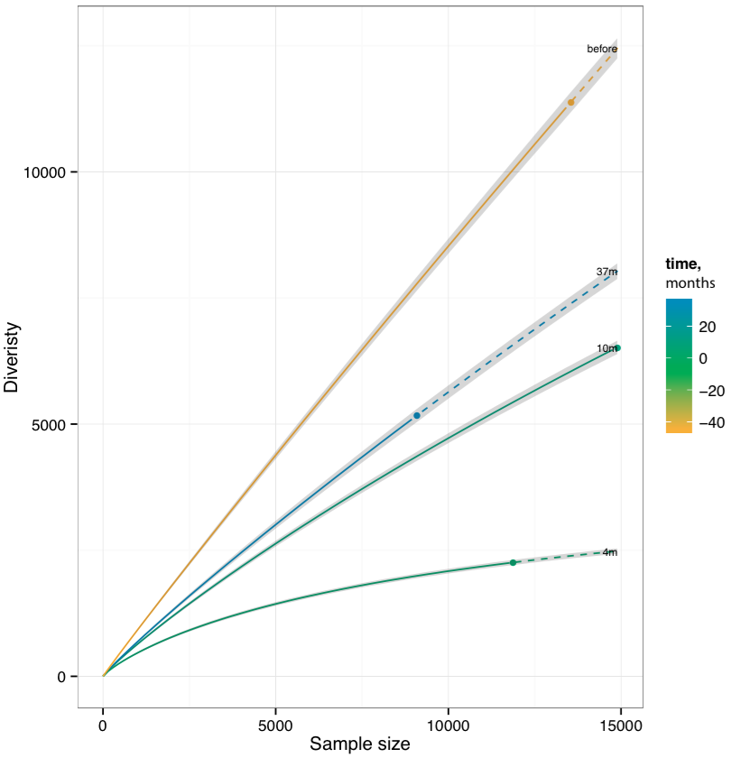

.. _diversity:

Diversity estimation
--------------------

.. note::

    Application of routines from this section is described in the following `tutorial <http://repseq-tutorial.readthedocs.org/>`__.

.. _PlotQuantileStats:

PlotQuantileStats
^^^^^^^^^^^^^^^^^

Plots a three-layer donut chart to visualize the repertoire clonality.

-  First layer ("set") includes the frequency of singleton ("1", met 
   once), doubleton ("2", met twice) and high-order ("3+", met three or
   more times) clonotypes. Singleton and doubleton frequency is an
   important factor in estimating the total repertoire diversity, e.g.
   Chao1 diversity estimator (see 
   `Colwell et al <http://viceroy.eeb.uconn.edu/estimates/EstimateSPages/EstSUsersGuide/References/ColwellEtAl2012.pdf>`__).
   We have also recently
   `shown <http://www.ncbi.nlm.nih.gov/pubmed/24510963>`__ that in whole
   blood samples, singletons have very nice correlation with the number of
   naive T-cells, which are the backbone of immune repertoire diversity.
-  The second layer ("quantile"), displays the abundance of top 20% ("Q1"),
   next 20% ("Q2"), ... (up to "Q5") clonotypes for clonotypes from "3+"
   set. In our experience this quantile plot is a simple and efficient way
   to display repertoire clonality. 
-  The last layer ("top") displays the individual abundances of top N clonotypes.

Command line usage
~~~~~~~~~~~~~~~~~~

.. code-block:: bash

    java -Xmx4G -jar vdjtools.jar PlotQuantileStats [options] sample.txt output_prefix

Parameters:

+-------------+-----------------------+------------+-----------------------------------------------------------------------------+
| Shorthand   |      Long name        | Argument   | Description                                                                 |
+=============+=======================+============+=============================================================================+
| ``-t``      | ``--top``             | int        | Number of top clonotypes to visualize. Should not exceed 10, default is 5   |
+-------------+-----------------------+------------+-----------------------------------------------------------------------------+
| ``-h``      | ``--help``            |            | Display help message                                                        |
+-------------+-----------------------+------------+-----------------------------------------------------------------------------+

Tabular output
~~~~~~~~~~~~~~

Following table with ``.qstat.txt`` prefix is generated,

+----------+--------------------------------------------------------+
| Column   | Description                                            |
+==========+========================================================+
| Type     | Detalization level: ``set``, ``quantile`` or ``top``   |
+----------+--------------------------------------------------------+
| Name     | Variable name: "1", "Q1", "CASSLAPGATNEKLFF", etc      |
+----------+--------------------------------------------------------+
| Value    | Corresponding relative abundance                       |
+----------+--------------------------------------------------------+

Graphical output
~~~~~~~~~~~~~~~~

Following plot with ``.qstat.pdf`` prefix is generated,

.. figure:: _static/images/modules/diversity-qstat.png
    :align: center
    :scale: 50 %
    
**Sample clonality plot**. See above for the description of plot structure.

--------------

.. _RarefactionPlot:

RarefactionPlot
^^^^^^^^^^^^^^^

Plots rarefaction curves for specified list of samples, that is, the
dependencies between sample diversity and sample size. Those curves are
interpolated from 0 to the current sample size and then extrapolated up
to the size of the largest of samples, allowing comparison of diversity
estimates. Interpolation and extrapolation are based on multinomial
models, see 
`Colwell et al <http://viceroy.eeb.uconn.edu/estimates/EstimateSPages/EstSUsersGuide/References/ColwellEtAl2012.pdf>`__
for details.

Command line usage
~~~~~~~~~~~~~~~~~~

.. code-block:: bash

    java -Xmx4G -jar vdjtools.jar RarefactionPlot \
    [options] [sample1.txt sample2.txt ... if -m is not specified] output_prefix

Parameters
~~~~~~~~~~

+-------------+------------------------+------------+---------------------------------------------------------------------------------------------------------------------------------------------------------------+
| Shorthand   |      Long name         | Argument   | Description                                                                                                                                                   |
+=============+========================+============+===============================================================================================================================================================+
| ``-m``      | ``--metadata``         | path       | Path to metadata file. See :ref:`common_params`                                                                                                               |
+-------------+------------------------+------------+---------------------------------------------------------------------------------------------------------------------------------------------------------------+
| ``-i``      | ``--intersect-type``   | string     | Set the intersection type used to collapse clonotypes before computing diversity. Defaults to ``strict`` (don't collapse at all). See :ref:`common_params`    |
+-------------+------------------------+------------+---------------------------------------------------------------------------------------------------------------------------------------------------------------+
| ``-s``      | ``--steps``            | integer    | Set the total number of points in the rarefaction curve, default is ``101``                                                                                   |
+-------------+------------------------+------------+---------------------------------------------------------------------------------------------------------------------------------------------------------------+
| ``-f``      | ``--factor``           | string     | Specifies plotting factor. See :ref:`common_params`                                                                                                           |
+-------------+------------------------+------------+---------------------------------------------------------------------------------------------------------------------------------------------------------------+
| ``-n``      | ``--numeric``          |            | Specifies if plotting factor is numeric. See :ref:`common_params`                                                                                             |
+-------------+------------------------+------------+---------------------------------------------------------------------------------------------------------------------------------------------------------------+
| ``-l``      | ``--label``            | string     | Specifies label used for plotting. See :ref:`common_params`                                                                                                   |
+-------------+------------------------+------------+---------------------------------------------------------------------------------------------------------------------------------------------------------------+
|             | ``--wide-plot``        |            | Set wide plotting area                                                                                                                                        |
+-------------+------------------------+------------+---------------------------------------------------------------------------------------------------------------------------------------------------------------+
|             | ``--label-exact``      |            | If set to true, will position sample labels exactly at observed samle size, will use the extrapolated sample size otherwise                                   |
+-------------+------------------------+------------+---------------------------------------------------------------------------------------------------------------------------------------------------------------+
| ``-h``      | ``--help``             |            | Display help message                                                                                                                                          |
+-------------+------------------------+------------+---------------------------------------------------------------------------------------------------------------------------------------------------------------+

Tabular output
~~~~~~~~~~~~~~

The following table with
``rarefaction.[intersection type shorthand].txt`` is generated:

+--------------+-------------------------------------------------------------------------+
| Column       | Definition                                                              |
+==============+=========================================================================+
| sample\_id   | Sample unique identifier                                                |
+--------------+-------------------------------------------------------------------------+
| ...          | Sample metadata columns, see :ref:`metadata` section                    |
+--------------+-------------------------------------------------------------------------+
| x            | Subsample size, reads                                                   |
+--------------+-------------------------------------------------------------------------+
| mean         | Mean diversity at given size                                            |
+--------------+-------------------------------------------------------------------------+
| ciL          | Lower bound of 95% confidence interval                                  |
+--------------+-------------------------------------------------------------------------+
| ciU          | Upper bound of 95% confidence interval                                  |
+--------------+-------------------------------------------------------------------------+
| type         | Data point type: ``0=interpolation``, ``1=exact``, ``2=extrapolation``  |
+--------------+-------------------------------------------------------------------------+

Graphical output
~~~~~~~~~~~~~~~~

A figure with the same suffix as output table and ``.pdf`` extension is
provided.

**Rarefaction plot**. Solid and dashed lines mark interpolated and extrapolated 
regions of rarefaction curves respectively, points mark exact sample 
size and diversity. Shaded areas mark 95% confidence intervals.

--------------

.. _CalcDiversityStats:

CalcDiversityStats
^^^^^^^^^^^^^^^^^^

Computes a set of diversity statistics, including 

-  Observed diversity, the total number of clonotypes in a sample
-  Lower bound total diversity (LBTD) estimates
   
   -  `Chao estimate <http://viceroy.eeb.uconn.edu/estimates/EstimateSPages/EstSUsersGuide/References/ColwellEtAl2012.pdf>`__ 
      (denoted *chao1*)
   -  `Efron-Thisted estimate <www.jstor.org/stable/2335721>`__ 

-  Diversity indices

   -  `Shannon-Wiener index <http://www.esajournals.org/doi/abs/10.2307/1934352>`__   
   -  `Inverse Simpson index <http://www.esajournals.org/doi/abs/10.2307/1934352>`__

-  `Extrapolated Chao diversity estimate 
   <http://viceroy.eeb.uconn.edu/estimates/EstimateSPages/EstSUsersGuide/References/ColwellEtAl2012.pdf>`__, 
   denoted *chaoE* here.
-  The `d50 index <http://www.google.com/patents/WO2012097374A1?cl=en>`__, 
   a recently developed immune diversity estimate

Diversity estimates are computed in two modes: using original data and via
several re-sampling steps (usually down-sampling to the size of smallest
dataset).

-  The estimates computed on original data could be biased by uneven
   sampling depth (sample size), of those only ``chaoE`` is properly
   normalized to be compared between samples. While not good for
   between-sample comparison, the LBTD estimates provided for original
   data are most useful for studying the fundamental properties of
   repertoires under study, i.e. to answer the question how large the
   repertoire diversity of an entire organism could be.
-  Estimates computed using re-sampling are useful for between-sample
   comparison, e.g. we have successfully used the re-sampled
   (normalized) observed diversity to measure the repertoire aging
   trends (see `this <http://www.ncbi.nlm.nih.gov/pubmed/24510963>`__
   paper).

.. hint::
    
    In our recent experience the observed diversity and LBTD estimates
    computed on re-sampled data provide best results for between-sample
    comparisons.

Command line usage
~~~~~~~~~~~~~~~~~~

.. code-block:: bash

    java -Xmx4G -jar vdjtools.jar CalcDiversityStats \
    [options] [sample1.txt sample2.txt ... if -m is not specified] output_prefix

Parameters:

+-------------+------------------------+------------+----------------------------------------------------------------------------------------------------------------------------------------------------------------------------------+
| Shorthand   |      Long name         | Argument   | Description                                                                                                                                                                      |
+=============+========================+============+==================================================================================================================================================================================+
| ``-m``      | ``--metadata``         | path       | Path to metadata file. See :ref:`common_params`                                                                                                                                  |
+-------------+------------------------+------------+----------------------------------------------------------------------------------------------------------------------------------------------------------------------------------+
| ``-i``      | ``--intersect-type``   | string     | Set the intersection type used to collapse clonotypes before computing diversity. Defaults to ``strict`` (don't collapse at all). See :ref:`common_params`                       |
+-------------+------------------------+------------+----------------------------------------------------------------------------------------------------------------------------------------------------------------------------------+
| ``-x``      | ``--downsample-to``    | integer    | Set the sample size to interpolate the diversity estimates via resampling. Default = size of smallest sample. Applies to diversity estimates stored in ``.resampled.txt`` table  |
+-------------+------------------------+------------+----------------------------------------------------------------------------------------------------------------------------------------------------------------------------------+
| ``-X``      | ``--extrapolate-to``   | integer    | Set the sample size to extrapolate the diversity estimates. Default = size of largest sample. Currently, only applies to ``chaoE`` diversity estimate.                           |
+-------------+------------------------+------------+----------------------------------------------------------------------------------------------------------------------------------------------------------------------------------+
|             | ``--resample-trials``  | integer    | Number of resamples for corresponding estimator. Default = 3                                                                                                                     |
+-------------+------------------------+------------+----------------------------------------------------------------------------------------------------------------------------------------------------------------------------------+
| ``-h``      | ``--help``             |            | Display help message                                                                                                                                                             |
+-------------+------------------------+------------+----------------------------------------------------------------------------------------------------------------------------------------------------------------------------------+

Tabular output
~~~~~~~~~~~~~~

Two tables with ``diversity.[intersection type shorthand].txt`` and
``diversity.[intersection type shorthand].resampled.txt`` are generated,
containing diversity estimates computed on original and down-sampled
datasets respectively.

Note that ``chaoE`` estimate is only present in the table generated for
original samples. Both tables contain means and standard deviations of
diversity estimates. Also note that standard deviation and mean values
for down-sampled datasets are computed based on N=3 re-samples.

Here is an example column layout, similar between both output tables:

+--------------------------------------+---------------------------------------------------------------------------------------------------------------+
| Column                               | Definition                                                                                                    |
+======================================+===============================================================================================================+
| sample\_id                           | Sample unique identifier                                                                                      |
+--------------------------------------+---------------------------------------------------------------------------------------------------------------+
| ...                                  | Sample metadata columns, see :ref:`metadata` section                                                          |
+--------------------------------------+---------------------------------------------------------------------------------------------------------------+
| reads                                | Number of reads in the sample                                                                                 |
+--------------------------------------+---------------------------------------------------------------------------------------------------------------+
| diversity                            | Diversity of the original sample (after collapsing to unique clonotypes according to ``-i`` parameter)        |
+--------------------------------------+---------------------------------------------------------------------------------------------------------------+
| extrapolate\_reads / resample\_reads | The reads used to extrapolate or re-sample in order to compute present diversity estiamtes                    |
+--------------------------------------+---------------------------------------------------------------------------------------------------------------+
| <*name*\ >\_mean                     | Mean value of the diversity estimate <*name*\ >                                                               |
+--------------------------------------+---------------------------------------------------------------------------------------------------------------+
| <*name*\ >\_std                      | Standard deviation of the diversity estimate <*name*\ >                                                       |
+--------------------------------------+---------------------------------------------------------------------------------------------------------------+
| ...                                  |                                                                                                               |
+--------------------------------------+---------------------------------------------------------------------------------------------------------------+

Graphical output
~~~~~~~~~~~~~~~~

none
