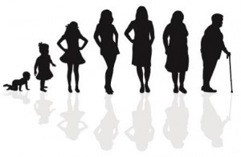
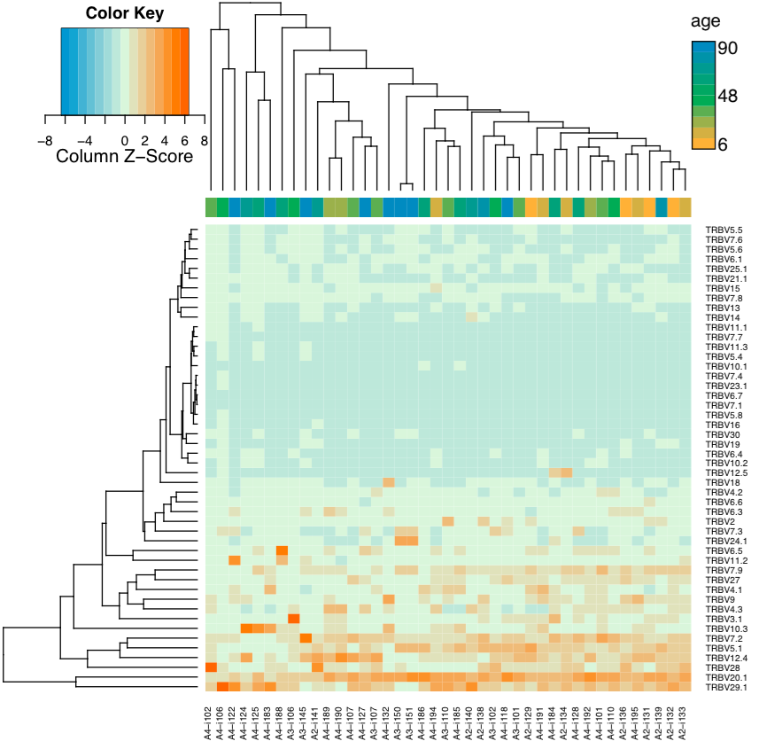
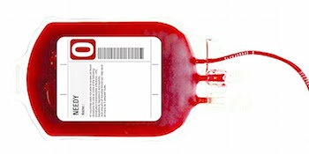
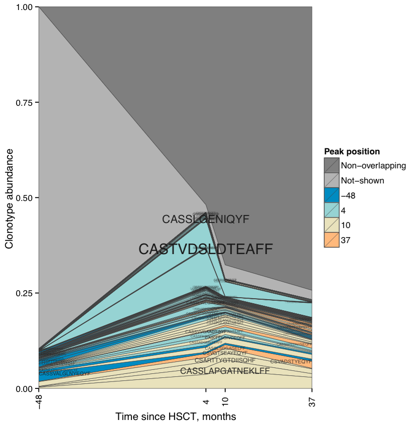
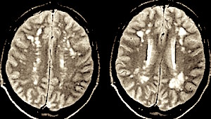
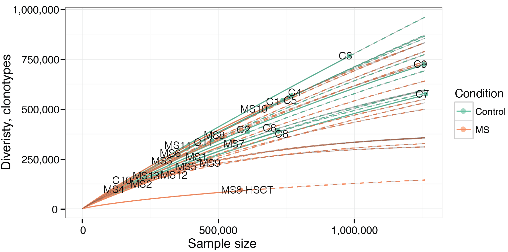

Examples
--------

There are several data bundles and shell scripts that cover most of
VDJtools usage scenarios available in the 
`examples repository <https://github.com/mikessh/vdjtools-examples>`__.

All of the examples refer to a folder with clonotype abundance tables 
(``samples/``). They contain a sample metadata file (``metadata.txt``, 
see :ref:`metadata`) and a shell script ``run.sh`` that contains a line-by-line
instructions to run various VDJtools routines. Sections below give
a detailed explanation for post-analysis steps for the available 
example datasets.

For more details on individual VDJtools routines see the :ref:`modules` section.

.. important:: 
    Samples in the repository are already converted to :ref:`vdjtools_format`. 

    We assume that you have set the following variable pointing to VDJtools executable JAR file:

    .. code-block:: bash

        # Point to VDJtools executable and allocate enough memory for JVM
        VDJTOOLS="java -Xmx20G -jar vdjtools.jar"

    or in case the software was installed using Homebrew

    .. code-block:: bash

        VDJTOOLS="vdjtools -Xmx20G"

Aging
^^^^^

The aging experiment involving 39 healthy donors of various ages and
both genders (see this
`paper <http://www.jimmunol.org/cgi/pmidlookup?view=long&pmid=24510963>`__
for details). This example allows to have a look at how a diverse set of
repertoire characteristics changes as we age. Post-analysis
can be performed using the following commands:

.. code-block:: bash

    # Basic analysis
    # Generate summary tables
    $VDJTOOLS CalcBasicStats -m metadata.txt out/0
    $VDJTOOLS CalcSpectratype -m metadata.txt out/1
    # -p for plotting, -f specifies metadata column for coloring, 
    # -n tells that factor is continuous
    $VDJTOOLS CalcSegmentUsage -m metadata.txt -p -f age -n out/2
    # the following routines run on a single sample
    $VDJTOOLS PlotFancySpectratype ../samples/A4-i125.txt.gz out/3
    $VDJTOOLS PlotSpectratypeV ../samples/A4-i125.txt.gz out/4
    $VDJTOOLS PlotFancyVJUsage ../samples/A4-i125.txt.gz out/5

    # Diversity estimation    
    # Plot clonality for a single sample
    $VDJTOOLS PlotQuantileStats ../samples/A4-i125.txt.gz out/6
    # Compute sample diversity estimates
    $VDJTOOLS CalcDiversityStats -m metadata.txt out/7
    # Perform rarefaction, -l specifies metadata column used as label
    $VDJTOOLS RarefactionPlot -m metadata.txt -f age -n -l sample.id out/8

    # Sample overlapping
    # Overlap two replicate samples coming from the same donor
    $VDJTOOLS OverlapPair -p ../samples/A4-i189.txt.gz ../samples/A4-i190.txt.gz out/9
    # computes various metrics characterizing the similarity between repertoires
    $VDJTOOLS CalcPairwiseDistances -m metadata.small.txt out/10
    # plotting routine is separated from time-consuming batch intersection
    # sample clustering is performed on this stage.
    # Here we use relative sample overlap as metric and age as continuous factor
    $VDJTOOLS ClusterSamples -p -f age -n -l sample.id out/10 out/10.age
    # here we use Variable segment Jensen-Shannon divergence and sex as discrete factor
    $VDJTOOLS ClusterSamples -p -e vJSD -f sex -l sample.id out/10 out/10.sex

    # Demonstrate sample operations and filtering
    # Remove cross-sample contamination (-c produces compressed output)
    $VDJTOOLS Decontaminate -m metadata.txt -c out/dec/
    # Down-sample datasets to 10,000 reads
    $VDJTOOLS Downsample -m metadata.txt -c -x 10000 out/ds/
    # Filter non-coding clonotypes
    $VDJTOOLS FilterNonFunctional -m metadata.txt -c out/nf/
    # Join samples into a single clonotype abundance matrix
    $VDJTOOLS JoinSamples -p -m metadata.small.txt out/12
    # Pool samples together
    $VDJTOOLS PoolSamples -m metadata.small.txt out/13

    # Annotate each clonotype in each sample with insert size,
    # total CDR3 hydrophobicity and other basic and amino acid properties
    $VDJTOOLS Annotate -m metadata.txt out/annot/

The code block above shows example usage for nearly all available commands. 
Rarefaction plot in the aging case displays a strong age-related diversity decrease. 
If running on a server with ~24GB of available RAM one can try out 
repertoire clustering for the whole experiment (replace ``metadata.small.txt`` with 
``metadata.txt`` for corresponding routines) which will show some interesting age-related 
trends.

    
**Variable segment usage in healthy donors of various age.** Note non-random 
sample grouping within dendrogram which can be attributed to stochastic 
antigen-driven expansion of clonotypes as we age. See :ref:`CalcSegmentUsage` for a 
detailed description of this plot.

--------------

HSCT
^^^^

Hematopoietic stem cell transfer (HSCT) is a great model for clonotype tracking and 
studying how the diversity of immune repertoire restores following myeloablation.
Post-analysis can be performed using the following commands:

.. code-block:: bash

    # Some basic analysis, same as above
    $VDJTOOLS CalcBasicStats -m metadata.txt out/0
    $VDJTOOLS CalcSpectratype -m metadata.txt out/1
    $VDJTOOLS CalcSegmentUsage -m metadata.txt -p -f "Time post HSCT, months" -n out/2

    # Diversity estimates
    # Note that selecting the factor having spaces in its name requires using double quotes
    $VDJTOOLS CalcDiversityStats -m metadata.txt out/3
    $VDJTOOLS RarefactionPlot -m metadata.txt -f "Time post HSCT, months" -n -l sample.id out/4

    # Clonotype tracking
    # Show repertoire changes that happen directly after HSCT
    $VDJTOOLS OverlapPair -p ../samples/minus48months.txt.gz ../samples/4months.txt.gz out/5
    # Next routine by default detects clonotypes that are present in 2 or more samples
    # and builds a time course for them, 
    # but here we trace clonotypes from first time point setting -x 0
    $VDJTOOLS TrackClonotypes -m metadata.txt -f "Time post HSCT, months" -x 0 -p out/6 

:ref:`RarefactionPlot` output shows how repertoire diversity is lost and restored
during post-HSCT period. The output of :ref:`ScanDatabase` displays that
CMV- and EBV-specific clonotypes start to dominate in the repertoire:
they comprise ~4% of repertoire prior to HSCT, but increase more than
2-fold in post-HSCT period.

**Clonotype abundance plot.** Stacked abundance for top 100 clonotypes 
at different time points is shown.
    
--------------

Multiple sclerosis (MS)
^^^^^^^^^^^^^^^^^^^^^^^

MS is a complex autoimmune disorder that does not 
show a strong T-cell clonotype bias (see 
`Turner et al. <http://www.nature.com/nri/journal/v6/n12/full/nri1977.html>`__).
Still some high-level repertoire features such as diversity and segment usage 
are distinct between affected persons and healthy donors.

.. code-block:: bash

    # Diversity estimation
    # Perform rarefaction analysis and compare repertoire diversity 
    # between MS patients and healthy donors
    $VDJTOOLS RarefactionPlot -m metadata.txt -l sample_id -f state diversity/
    $VDJTOOLS CalcDiversityStats -m metadata.txt diversity/

    # Shows that MS cluster is not that compact as the 
    # cluster of healthy donors suggesting 
    # private nature of MS clonotypes
    # -i aa!nt is used to discard CDR3 nucleotide sequence matches
	# (note the ! character should be escaped when running on Unix system: \!)
    # and focus on amino-acid matches as strong cross-contamination is present
    $VDJTOOLS CalcPairwiseDistances -i aa\!nt -m metadata.txt overlap/
    $VDJTOOLS ClusterSamples -p -f state -i aa\!nt overlap/ overlap/state
    $VDJTOOLS TestClusters -i aa\!nt overlap/state overlap/state

    # Shows V usage level trends and cluster samples based on V usage profiles    
    $VDJTOOLS CalcSegmentUsage -m metadata.txt -p -f state vusage/
    
    # Shows details of repertoire changes for MS8 patient that has
    # undergone a HSCT (MS14 is a post-HSCT blood sample)
    $VDJTOOLS OverlapPair -p ../samples/MS8.txt.gz ../samples/MS14.txt.gz overlap/
    $VDJTOOLS PlotFancyVJUsage ../samples/MS8.txt.gz hsct/MS8
    $VDJTOOLS PlotFancyVJUsage ../samples/MS14.txt.gz hsct/MS8-HSCT
    
Below is an example of :ref:`RarefactionPlot` graphical output.

**Rarefaction analysis of MS and healthy donor repertoires.** Note that 
rarefaction curves for MS patients are generally lower than those for healthy 
donors, indicating the presence of clonal expansion in former.