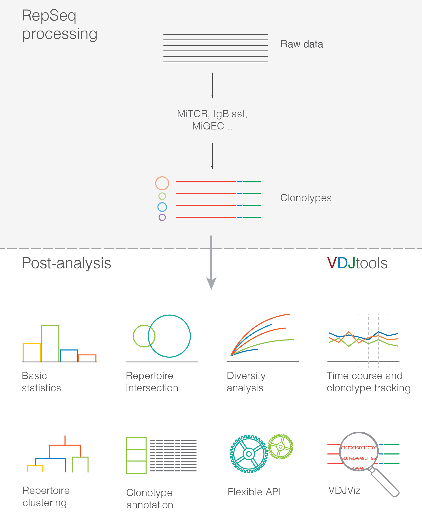

.. vdjtools documentation master file, created by
   sphinx-quickstart on Tue Mar 24 17:33:45 2015.
   You can adapt this file completely to your liking, but it should at least
   contain the root `toctree` directive.

Introduction
============

VDJtools is an open-source Java/Groovy-based framework designed to
facilitate analysis of immune repertoire sequencing
(`RepSeq <http://www.ncbi.nlm.nih.gov/pubmed/22043864>`__) data.
VDJtools computes a wide set of statistics and is able to perform
various forms of cross-sample analysis. Both comprehensive tabular
output and publication-ready plots are provided.

To the best of our knowledge, currently there is no other software tool
able to perform RepSeq post-analysis. Therefore most of the analysis of
this kind is done using in-house scripts, which definitely leads to
"re-inventing the bicycle" problem.

The main aims of **VDJtools Project** are:

-  To ensure consistency between post-analysis methods and results
-  To save the time of bioinformaticians analyzing RepSeq data
-  To create an API framework facilitating development of new RepSeq
   analysis applications
-  To provide a simple enough command line tool so it could be used by
   immunologists and biologists with little computational background

Features and workflow
---------------------

Prerequisites
-------------

Installation
~~~~~~~~~~~~

As the core framework is complied into Java™ bytecode, it could in
theory be run on any platform that has a `JRE
v1.7 <http://www.oracle.com/technetwork/java/javase/downloads/java-se-jre-7-download-432155.html>`__\ +
installed. The only thing one needs to do is to download the binaries
from the `latest
release <https://github.com/mikessh/vdjtools/releases/latest>`__.

Note that the graphical output requires
`R <http://www.r-project.org/>`__ programming language and corresponding
modules to be installed. See the
`Installation <https://github.com/mikessh/vdjtools/wiki/Installation>`__
section for details.

Hardware
~~~~~~~~

VDJtools could be run on most of commodity hardware setups and is
optimized to take advantage of parallel computations. The pipeline was
successfully stress-tested using ~70 diverse samples containing
repertoire snapshot of around 500,000 human T-cells on a server having
2x Intel Xeon E5-1620 and 64 Gb RAM.

Input
~~~~~

The framework is currently capable to analyze the output of the
following V-(D)-J junction mapping software:

-  `MiTCR <http://mitcr.milaboratory.com/>`__
-  `MiGEC <https://github.com/mikessh/migec>`__/`CdrBlast <https://github.com/mikessh/migec#4-cdrblast-batch>`__
-  `IgBlastWrapper <https://github.com/mikessh/igblastwrp>`__

As well as a *simple* tab-delimited file, see
`Input <https://github.com/mikessh/vdjtools/wiki/Input>`__ section for
details.

**NOTE:** > Unfortunately, overwhelming number of RepSeq software
doesn't allow grouping V-(D)-J junctions into a clonotype abundance
tables. In theory the output of most RepSeq software could be collapsed
to them, yet this is a tricky procedure involving heuristics for CDR3
sequence clustering. Moreover, it is quite painful to develop a parser
for all the available software. It would also be more technically
appropriate to implement it at the RepSeq processing software side.
Therefore I've only focused on developing a wrapper for IgBlast, which
provides very accurate V-(D)-J alignments. Any contributions on this
`issue <https://github.com/mikessh/vdjtools/issues/13>`__ are welcome!

Future directions
-----------------

-  Developing better visualization for clonotype tracking for
   categorical case
-  Visualizing a case with multiple samples/tissues/time-courses
-  Adding support for a comprehensive antibody repertoire analysis
-  Hypermutation statistics (substitution rates, etc)
-  Reconstruction of B-cell clonal lineages
-  Visualization of hypermutation graphs
-  Working with CDR3 amino acid sequence motifs
-  Implementation of PWM analysis framework

Table of Contents
-----------------

.. toctree::
   :maxdepth: 2
   
   install
   usage
   input
   modules
   browser

Indices and tables
==================

* :ref:`genindex`
* :ref:`modindex`
* :ref:`search`
