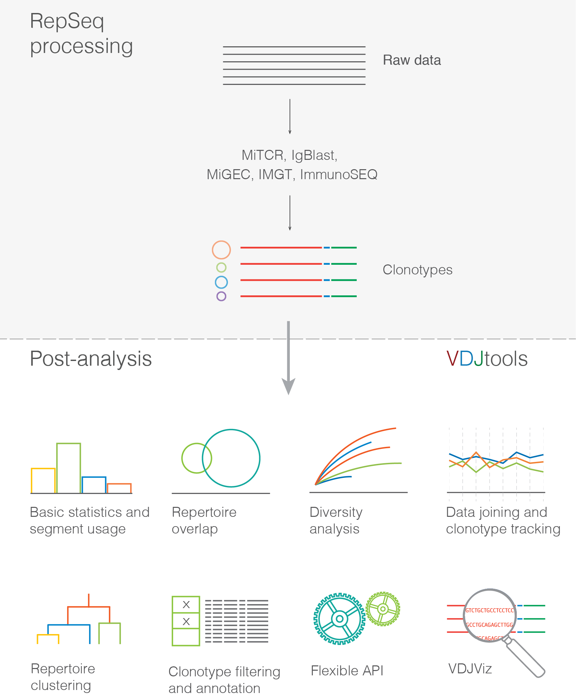

Introduction
------------

Features and workflow
^^^^^^^^^^^^^^^^^^^^^

Prerequisites
^^^^^^^^^^^^^

Software
~~~~~~~~

As the core framework is complied into Java™ bytecode, it could in
theory be run on any platform that has a Java Runtime Environment 
installed. The software is distributed in a form of an executable 
JAR file.

Note that the graphical output requires
`R <http://www.r-project.org/>`__ programming language and corresponding
modules to be installed.

See the :ref:`install` section for more details.

Hardware
~~~~~~~~

VDJtools could be run on most of commodity hardware setups and is
optimized to take advantage of parallel computations. The pipeline was
successfully stress-tested using ~70 diverse samples containing
repertoire snapshot of around 500,000 human T-cells on a UNIX server with
2x Intel Xeon E5-1620 and 64 Gb RAM.

Input
~~~~~

The framework is currently able to import and analyze the output of the
following V-(D)-J junction mapping software and analysis platforms:

-  MiTCR
-  MiGEC
-  IgBlast (via our MIGMAP wrapper)
-  IMGT
-  ImmunoSEQ
-  VDJdb
-  Vidjil
-  RTCR
-  MiXCR
-  ImSEQ

For more details see the :ref:`software` section. VDJtools converts those files to 
its internal format (see :ref:`vdjtools_format`) which is used throughout the pipeline.

.. note::
    If this list is missing your favourite RepSeq processing software, please
    add a corresponding `feature request <https://github.com/mikessh/vdjtools/issues>`__ 
    Any contributions in form of pull requests are also welcome.
