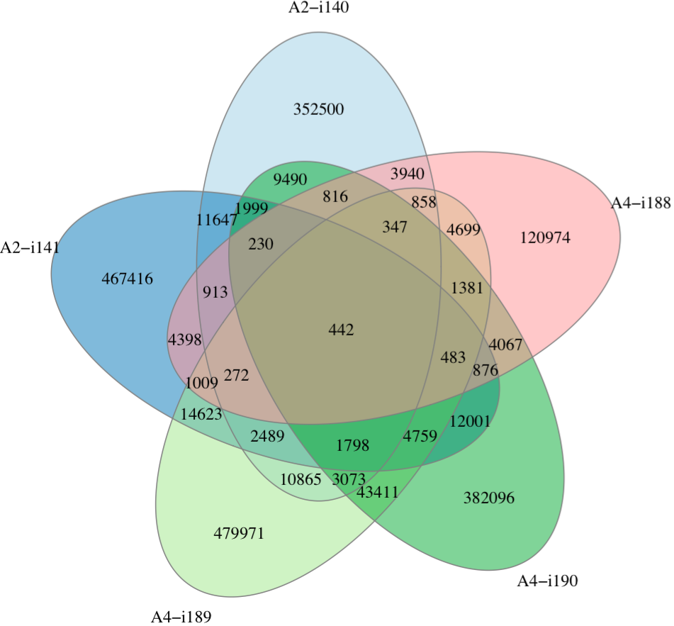

.. _operate:

Operate on clonotype tables
---------------------------

.. _JoinSamples:

JoinSamples
^^^^^^^^^^^^

Joins several clonotype tables together to form a joint clonotype abundance table.
Joint clonotype holds information on all clonotypes that match under a certain 
comparison criteria (e.g. identical CDR3nt and V segment), their samples of origin 
and corresponding abundances. At least two samples should be specified for this 
routine. For two sample case also consider using :ref:`OverlapPair` routine.

.. attention:: This is the most memory-demanding routine, especially for a large number of samples.

Command line usage
~~~~~~~~~~~~~~~~~~

.. code-block:: bash

    $VDJTOOLS JoinSamples \
    [options] [sample1.txt sample2.txt sample3.txt ... if -m is not specified] output_prefix

Parameters:

+-------------+------------------------+-----------+-------------------------------------------------------------------------------------------------------------+
| Shorthand   |      Long name         | Argument  | Description                                                                                                 |
+=============+========================+===========+=============================================================================================================+
| ``-m``      | ``--metadata``         | path      | Path to metadata file. See See :ref:`common_params`                                                         |
+-------------+------------------------+-----------+-------------------------------------------------------------------------------------------------------------+
| ``-i``      | ``--intersect-type``   | string    | Sample intersection rule. Defaults to ``strict``. See :ref:`common_params`                                  |
+-------------+------------------------+-----------+-------------------------------------------------------------------------------------------------------------+
| ``-x``      | ``--times-detected``   | integer   | Minimal number of samples in which a clonotype should be detected to get to the final output. Default = 2   |
+-------------+------------------------+-----------+-------------------------------------------------------------------------------------------------------------+
| ``-p``      | ``--plot``             |           | Turns on plotting. See :ref:`common_params`                                                                 |
+-------------+------------------------+-----------+-------------------------------------------------------------------------------------------------------------+
| ``-c``      | ``--compress``         |           | Compressed output for clonotype table. See :ref:`common_params`                                             |
+-------------+------------------------+-----------+-------------------------------------------------------------------------------------------------------------+
| ``-h``      | ``--help``             |           | Display help message                                                                                        |
+-------------+------------------------+-----------+-------------------------------------------------------------------------------------------------------------+

Tabular output
~~~~~~~~~~~~~~

Summary table suffixed ``join.[value of -i argument].summary.txt``
is created with the following columns.

+----------------------+----------------------------------------------------------------------------------------+
| Column               | Description                                                                            |
+======================+========================================================================================+
| <first sample id \>  | Indicator for the first sample, either ``0`` or ``1``                                  |
+----------------------+----------------------------------------------------------------------------------------+
| <second sample id \> | Indicator for the second sample                                                        |
+----------------------+----------------------------------------------------------------------------------------+
| ...                  |                                                                                        |
+----------------------+----------------------------------------------------------------------------------------+
| clonotypes           | Number of clonotypes detected in all samples that have ``1`` indicator in a given row. |
+----------------------+----------------------------------------------------------------------------------------+

Joint clonotype abundance table file having ``join.[value of -i argument].table.txt`` 
suffix that contains joint clonotypes detected in at least ``-x`` samples. 
Table structure is described in the section below.

.. _joint_table_structure:

Joint clonotype abundance table structure
~~~~~~~~~~~~~~~~~~~~~~~~~~~~~~~~~~~~~~~~~

First columns have the same meaning as in :ref:`vdjtools_format` 
clonotype abundance table, they are computed as follows:

-  Normalized frequency is computed as geometric mean 
   of clonotype frequencies that comprise a given joint clonotype
   in intersected samples. If clonotype is missing, its frequency 
   is set to ``1e-9``.
   
   .. note::
       
       Joint clonotype is formed as a union of all clonotype variants
       in all samples that match under the specified ``-i`` rule.
   
-  Normalized count is calculated by scaling normalized frequencies
   so that the joint clonotypes with smallest frequency has a count 
   of ``1``.
   
-  Clonotype signature (CDR3nt, CDR3aa, V, D and J) is taken from a
   representative clonotype.

   .. note::

       When several clonotype variants are present in samples that
       correspond to the same clonotype under ``-i`` rule (e.g.
       several Variable segment variants when ``-i nt`` is set), only the
       most abundant form is selected as a **representative** clonotype 
       to final output.        

+-------------------+------------------------------------------------------------------------------+
| Column            | Description                                                                  |
+===================+==============================================================================+
| count             | Normalized clonotype count                                                   |
+-------------------+------------------------------------------------------------------------------+
| freq              | Normalized clonotype frequency                                               |
+-------------------+------------------------------------------------------------------------------+
| cdr3nt            | Representative CDR3 nucleotide sequence                                      |
+-------------------+------------------------------------------------------------------------------+
| cdr3aa            | Representative CDR3 amino acid sequence                                      |
+-------------------+------------------------------------------------------------------------------+
| v                 | Representative Variable segment                                              |
+-------------------+------------------------------------------------------------------------------+
| d                 | Representative Diversity segment                                             |
+-------------------+------------------------------------------------------------------------------+
| j                 | Representative Joining segment                                               |
+-------------------+------------------------------------------------------------------------------+
| peak              | Index of a time point at which given clonotype reaches its maximum frequency |
+-------------------+------------------------------------------------------------------------------+
| occurrences       | Number of samples the joint clonotype was detected in                        |
+-------------------+------------------------------------------------------------------------------+
| <*sample name*\ > | Frequency of a joint clonotype at corresponding sample                       |
+-------------------+------------------------------------------------------------------------------+
| ...               |                                                                              |
+-------------------+------------------------------------------------------------------------------+

Graphical output
~~~~~~~~~~~~~~~~

A Venn diagram can be found in a file having 
``join.[value of -i argument].venn.pdf`` suffix. Note 
that if there are more than 5 samples, it will be 
constructed for the first 5 samples. Plotting is performed 
using `VennDiagram <http://cran.r-project.org/web/packages/VennDiagram/index.html>`__ 
R package.

    
**Overlap of clonotype sets**. See `Venn diagram wiki article <http://en.wikipedia.org/wiki/Venn_diagram>`__ 
for the description.

-----------

.. _PoolSamples:

PoolSamples
^^^^^^^^^^^

Pools clonotypes from several samples together and merges clonotypes that 
that match under a certain comparison criteria (e.g. identical CDR3nt and V segment). 
Note that this routine can be used with a single sample to aggregate the sameple, e.g. 
by CDR3 amino acid sequence, in this case CDR3 nucleotide sequence, V and J segments will be 
taken from a representative clonotype variant with the highest frequency.

Command line usage
~~~~~~~~~~~~~~~~~~

.. code-block:: bash

    $VDJTOOLS PoolSamples \
    [options] [sample1.txt sample2.txt sample3.txt ... if -m is not specified] output_prefix

Parameters:

+-------------+------------------------+-----------+-------------------------------------------------------------------------------------------------------------+
| Shorthand   |      Long name         | Argument  | Description                                                                                                 |
+=============+========================+===========+=============================================================================================================+
| ``-m``      | ``--metadata``         | path      | Path to metadata file. See :ref:`common_params`                                                             |
+-------------+------------------------+-----------+-------------------------------------------------------------------------------------------------------------+
| ``-i``      | ``--intersect-type``   | string    | Sample intersection rule. Defaults to ``strict``. See :ref:`common_params`                                  |
+-------------+------------------------+-----------+-------------------------------------------------------------------------------------------------------------+
| ``-p``      | ``--plot``             |           | Turns on plotting. See :ref:`common_params`                                                                 |
+-------------+------------------------+-----------+-------------------------------------------------------------------------------------------------------------+
| ``-c``      | ``--compress``         |           | Compressed output for clonotype table. See :ref:`common_params`                                             |
+-------------+------------------------+-----------+-------------------------------------------------------------------------------------------------------------+
| ``-h``      | ``--help``             |           | Display help message                                                                                        |
+-------------+------------------------+-----------+-------------------------------------------------------------------------------------------------------------+

Tabular output
~~~~~~~~~~~~~~

Summary table suffixed ``pool.[value of -i argument].summary.txt``
is created with the following columns.

+----------------------+----------------------------------------------------------------------------------------+
| Column               | Description                                                                            |
+======================+========================================================================================+
| incidence.count      | Indicator for the first sample, either ``0`` or ``1``                                  |
+----------------------+----------------------------------------------------------------------------------------+
| read.count           | Total number of reads associated with a given pooled clonotype                         |
+----------------------+----------------------------------------------------------------------------------------+
| convergence          | Total number of clonotype variants that match the pooled clonotype under ``-i`` rule.  |
+----------------------+----------------------------------------------------------------------------------------+

Pooled clonotype abundance table file having ``pool.[value of -i argument].summary.txt``.
Table structure is described in the section below.

.. _pooled_table_structure:

Pooled clonotype abundance table structure
~~~~~~~~~~~~~~~~~~~~~~~~~~~~~~~~~~~~~~~~~~

First columns have the same meaning as in :ref:`vdjtools_format` 
clonotype abundance table, they are computed as follows:
   
-  Pooled count is computed as the total number of reads associated 
   with clonotype variants that match under the specified ``-i`` rule.
   
-  Frequency is computed as pooled count divided by total number of reads
   in all samples.
   
-  Clonotype signature (CDR3nt, CDR3aa, V, D and J) is taken from a
   representative clonotype in the same way as described for 
   :ref:`joint_table_structure`.      

+-------------------+----------------------------------------------------------------------------------------+
| Column            | Description                                                                            |
+===================+========================================================================================+
| count             | Pooled clonotype count                                                                 |
+-------------------+----------------------------------------------------------------------------------------+
| freq              | Pooled clonotype frequency                                                             |
+-------------------+----------------------------------------------------------------------------------------+
| cdr3nt            | Representative CDR3 nucleotide sequence                                                |
+-------------------+----------------------------------------------------------------------------------------+
| cdr3aa            | Representative CDR3 amino acid sequence                                                |
+-------------------+----------------------------------------------------------------------------------------+
| v                 | Representative Variable segment                                                        |
+-------------------+----------------------------------------------------------------------------------------+
| d                 | Representative Diversity segment                                                       |
+-------------------+----------------------------------------------------------------------------------------+
| j                 | Representative Joining segment                                                         |
+-------------------+----------------------------------------------------------------------------------------+
| incidence         | Number of samples containing clonotype variants that comprise a given pooled clonotype |
+-------------------+----------------------------------------------------------------------------------------+
| convergence       | Total number of clonotype variants that match the pooled clonotype under ``-i`` rule   |
+-------------------+----------------------------------------------------------------------------------------+

Graphical output
~~~~~~~~~~~~~~~~

planned

