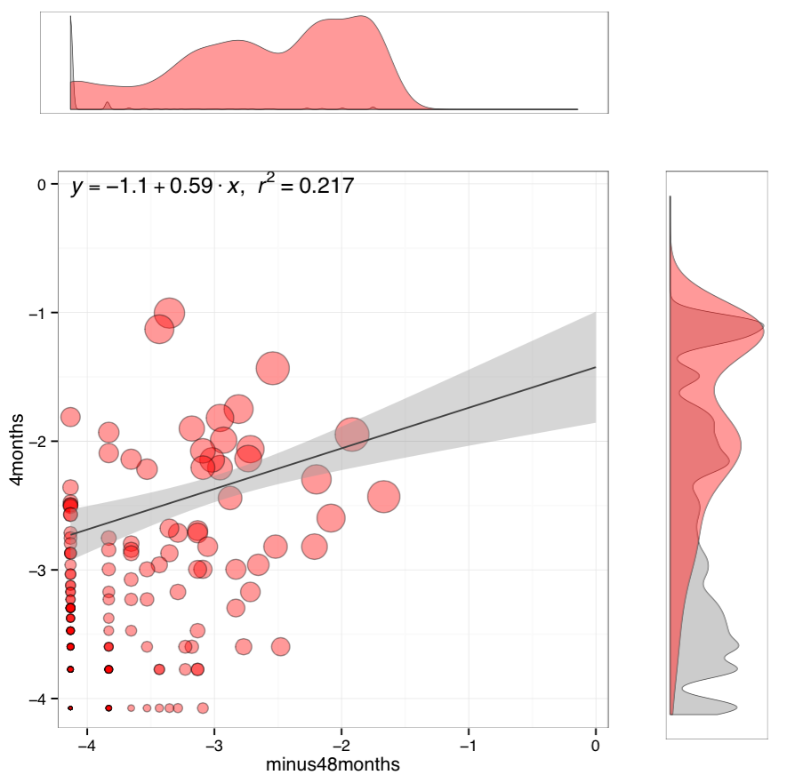
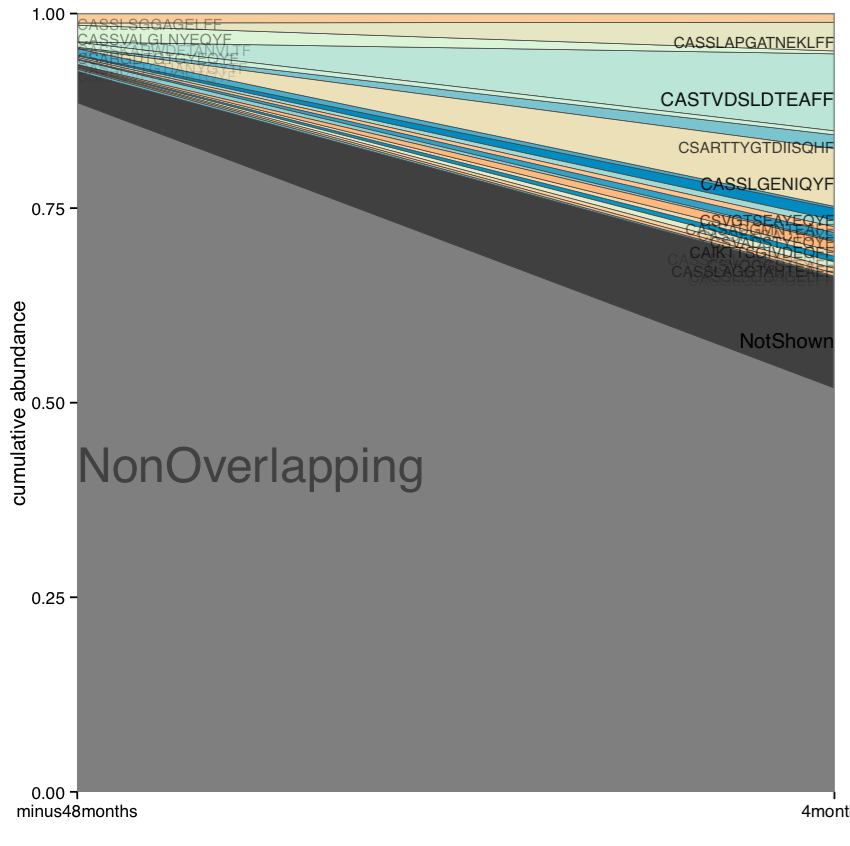
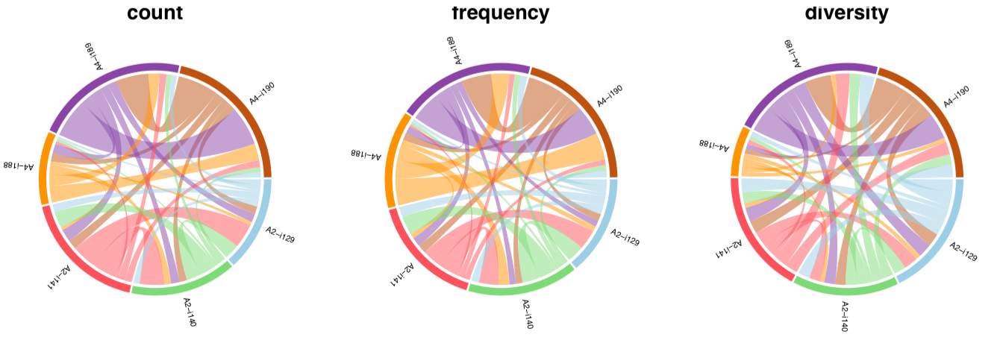
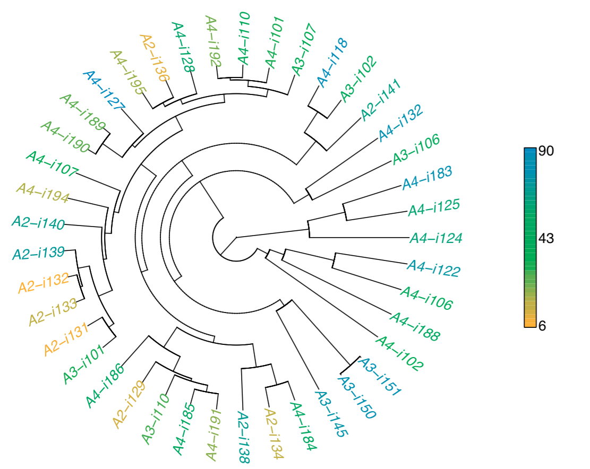
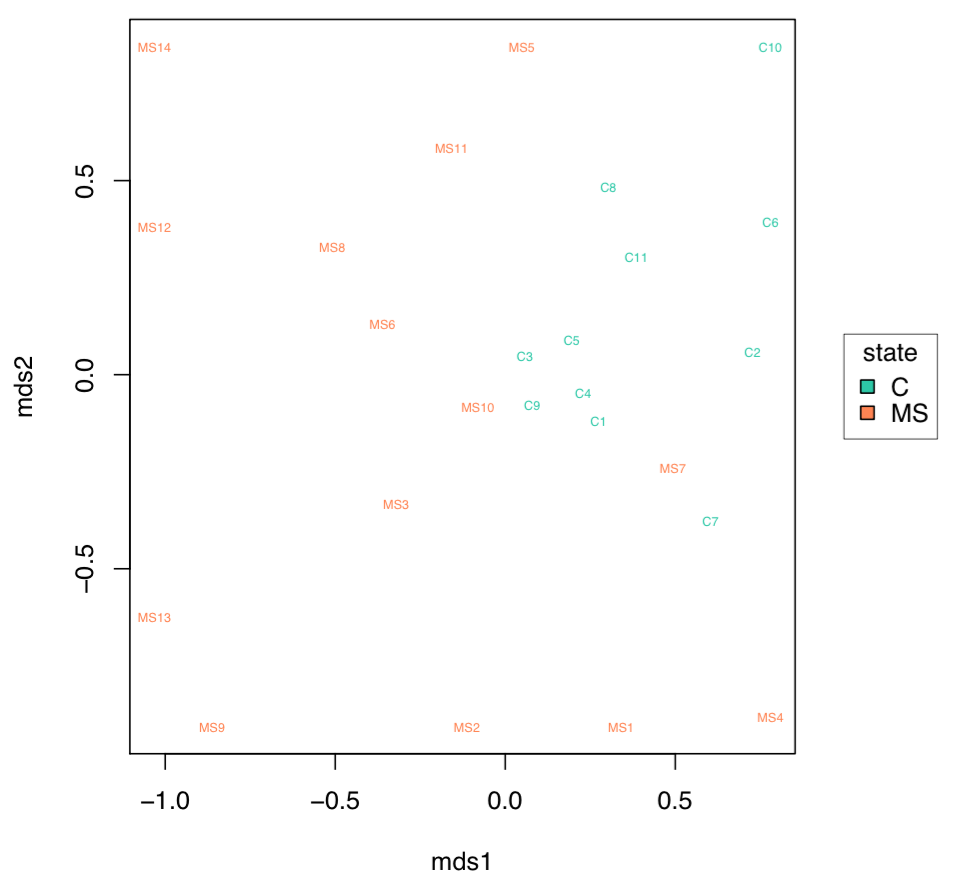
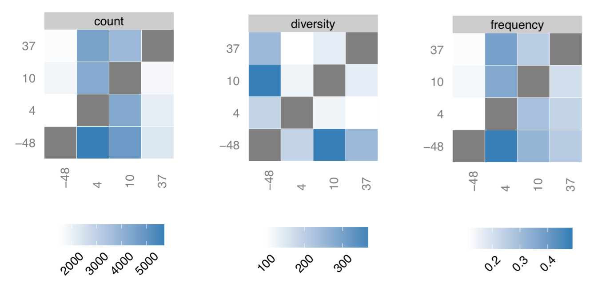
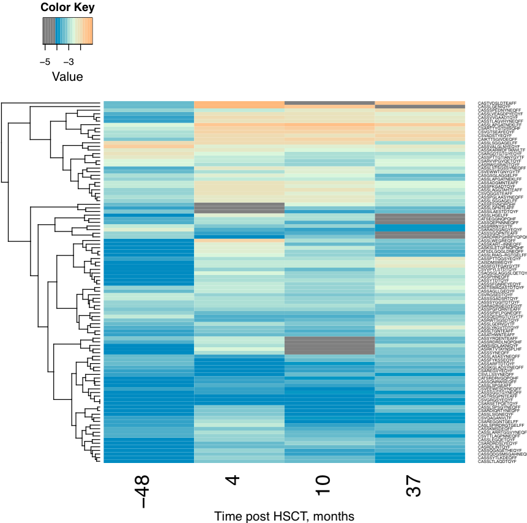

.. _overlap:

Repertoire overlap analysis
---------------------------

.. _OverlapPair:

OverlapPair
^^^^^^^^^^^

Performs a comprehensive analysis of clonotype sharing for a pair of samples.

Command line usage
~~~~~~~~~~~~~~~~~~

.. code-block:: bash

    $VDJTOOLS OverlapPair [options] sample1.txt sample2.txt output_prefix

Parameters:

+-------------+------------------------+------------+-----------------------------------------------------------------------------------------------------------------------------------------------------+
| Shorthand   |      Long name         | Argument   | Description                                                                                                                                         |
+=============+========================+============+=====================================================================================================================================================+
| ``-i``      | ``--intersect-type``   | string     | Sample intersection rule. Defaults to ``strict``. See :ref:`common_params`                                                                          |
+-------------+------------------------+------------+-----------------------------------------------------------------------------------------------------------------------------------------------------+
| ``-t``      | ``--top``              | int        | Number of top clonotypes to visualize explicitly on stack are plot and provide in the collapsed joint table. Should not exceed 100, default is 20   |
+-------------+------------------------+------------+-----------------------------------------------------------------------------------------------------------------------------------------------------+
| ``-p``      | ``--plot``             |            | Turns on plotting. See :ref:`common_params`                                                                                                         |
+-------------+------------------------+------------+-----------------------------------------------------------------------------------------------------------------------------------------------------+
|             | ``--plot-area-v2``     |            | Alternative plotting mode, clonotype CDR3 sequences are shown at plot sides and connected to corresponding areas with lines.                        |
+-------------+------------------------+------------+-----------------------------------------------------------------------------------------------------------------------------------------------------+
| ``-h``      | ``--help``             |            | Display help message                                                                                                                                |
+-------------+------------------------+------------+-----------------------------------------------------------------------------------------------------------------------------------------------------+

Tabular output
~~~~~~~~~~~~~~

Two joint clonotype abundance tables with
``paired.[intersection type shorthand].table.txt`` and
``paired.[intersection type shorthand].table.collapsed.txt`` suffices
are generated. Tables are written in :ref:`vdjtools_format`. 
Collapsed table contains rows corresponding to top N clonotypes and 
summary abundances for non-overlapping and hidden clonotypes.

See :ref:`joint_table_structure` for a detailed description of table columns.

A summary table (``paired.[intersection type shorthand].summary.txt``
suffix) containing information on sample overlap size, etc, is also
provided. See tabular output in :ref:`CalcPairwiseDistances` section
below for details.

Graphical output
~~~~~~~~~~~~~~~~

A composite scatterplot plot having
``paired.[intersection type shorthand].scatter.pdf`` suffix is
generated. The second plot file with
``.paired.[intersection type shorthand].table.collapsed.pdf`` suffix
contains a clonotype stack area plot. 

    
**Clonotype scatterplot**. Main frame contains a scatterplot of clonotype abundances (overlapping 
clonotypes only) and a linear regression. Point size is scaled to the geometric mean of clonotype 
frequency in both samples. Scatterplot axes represent log10 clonotype frequencies in each sample. 
Two marginal histograms show the overlapping (red) and total clonotype (grey) abundance distributions 
in corresponding sample. Histograms are weighted by clonotype abundance, i.e. they display 
read distribution by clonotype size.

    
**Shared clonotype abundance plot**. Plot shows details for top 20 clonotypes 
shared between samples, as well as collapsed ("NotShown") and non-overlapping
("NonOverlapping") clonotypes. Clonotype CDR3 amino acid sequence is
plotted against the sample where the clonotype reaches maximum
abundance.

--------------

.. _CalcPairwiseDistances:

CalcPairwiseDistances
^^^^^^^^^^^^^^^^^^^^^

Performs an all-versus-all pairwise overlap for a list of samples 
and computes a set of repertoire similarity measures. At least 3 samples 
should be provided. Note that this is one of most the memory-demanding routines, 
as it will load all samples into memory at once (unless used with ``--low-mem`` option).

Repertoire similarity measures include

-  Pearson correlation of clonotype frequencies, restricted only to the overlapping clonotypes 

   .. math:: R_{ij} = \frac{\sum^N_{k=1} \left(\phi _{ik} - \bar{\phi _{i}} \right ) \left(\phi _{jk} - \bar{\phi _{j}} \right )}{\sqrt{\sum^N_{k=1} \left(\phi _{ik} - \bar{\phi _{i}} \right )^2 \sum^N_{k=1}  \left(\phi _{jk} - \bar{\phi _{j}} \right )^2}}

   where :math:`k=1..N` are the indices of overlapping clonotypes, 
   :math:`\phi_{ik}` is the frequency of clonotype :math:`k` in sample :math:`i` and 
   :math:`\bar{\phi_{i}}` is the average frequency of overlapping clonotypes in sample :math:`i`.
-  Relative overlap diversity, computed with the following normalization 

   .. math:: D_{ij} = \frac{d_{ij}}{d_{i}d_{j}}
   
   where :math:`d_{ij}` is the number of clonotypes present in both samples 
   and :math:`d_{i}` is the diversity of sample :math:`i`. See 
   `this paper <http://www.ncbi.nlm.nih.gov/pmc/articles/PMC3872297/>`__ 
   for the rationale behind normalization.   
-  Geometric mean of relative overlap frequencies

   .. math:: F_{ij} = \sqrt{f_{ij}f_{ji}}
   
   where :math:`f_{ij}=\sum^N_{k=1}\phi_{ik}` is the total frequency of clonotypes that overlap
   between samples :math:`i` and :math:`j` in sample :math:`i`.
-  Сlonotype-wise sum of geometric mean frequencies

   .. math:: F2_{ij} = \sum^N_{k=1}\sqrt{\phi_{ik}\phi_{jk}}
   
   Note that this measure performs similar to :math:`F` and provides slightly more robust 
   results in case cross-sample contamination is present.
-  `Jensen-Shannon divergence 
   <https://www.cise.ufl.edu/~anand/sp06/jensen-shannon.pdf>`__ between 
   Variable segment usage profiles 
   (will be moved to :ref:`CalcSegmentUsage` in near future).
-  `Jaccard index <http://en.wikipedia.org/wiki/Jaccard_index>`__.
-  `Morisita-Horm index <http://en.wikipedia.org/wiki/Morisita's_overlap_index>`__.

:ref:`ClusterSamples` routine can be additionally run for CalcPairwiseDistances
results.

Command line usage
~~~~~~~~~~~~~~~~~~

.. code-block:: bash

    $VDJTOOLS CalcPairwiseDistances \
    [options] [sample1.txt sample2.txt sample3.txt ... if -m is not specified] output_prefix

Parameters:

+-------------+------------------------+------------+-----------------------------------------------------------------------------------------------------+
| Shorthand   |      Long name         | Argument   | Description                                                                                         |
+=============+========================+============+=====================================================================================================+
| ``-m``      | ``--metadata``         | path       | Path to metadata file. See :ref:`common_params`                                                     |
+-------------+------------------------+------------+-----------------------------------------------------------------------------------------------------+
| ``-i``      | ``--intersect-type``   | string     | Sample intersection rule. Defaults to ``aa``. See :ref:`common_params`                              |
+-------------+------------------------+------------+-----------------------------------------------------------------------------------------------------+
|             | ``--low-mem``          |            | Low memory mode, will keep only a pair of samples in memory during execution, but run much slower.  |
+-------------+------------------------+------------+-----------------------------------------------------------------------------------------------------+
| ``-p``      | ``--plot``             |            | Turns on plotting. See :ref:`common_params`                                                         |
+-------------+------------------------+------------+-----------------------------------------------------------------------------------------------------+
| ``-h``      | ``--help``             |            | Display help message                                                                                |
+-------------+------------------------+------------+-----------------------------------------------------------------------------------------------------+

Tabular output
~~~~~~~~~~~~~~

A table suffixed
``intersect.batch.[intersection type shorthand].summary.txt`` with a
comprehensive information on sample pair intersections is generated.
This table is non-redundant: it contains ``N * (N - 1) / 2`` rows
corresponding to upper diagonal of matrix of possible pairs ``(i,j)``.
Table layout is given below in three parts.

**General info**

+-----------------+-----------------------------------------------------------------------------------------------------------------------------+
| Column          | Description                                                                                                                 |
+=================+=============================================================================================================================+
| 1\_sample\_id   | First sample unique identifier                                                                                              |
+-----------------+-----------------------------------------------------------------------------------------------------------------------------+
| 2\_sample\_id   | Second sample unique identifier                                                                                             |
+-----------------+-----------------------------------------------------------------------------------------------------------------------------+
| div1            | Total number of clonotypes in the first sample after identical clonotypes are collapsed based on intersection type ``-i``   |
+-----------------+-----------------------------------------------------------------------------------------------------------------------------+
| div2            | Same as above, second sample                                                                                                |
+-----------------+-----------------------------------------------------------------------------------------------------------------------------+
| div12           | Number of overlapping clonotypes                                                                                            |
+-----------------+-----------------------------------------------------------------------------------------------------------------------------+
| div21           | Same as above                                                                                                               |
+-----------------+-----------------------------------------------------------------------------------------------------------------------------+
| count1          | Total number of reads in the first sample                                                                                   |
+-----------------+-----------------------------------------------------------------------------------------------------------------------------+
| count2          | ...                                                                                                                         |
+-----------------+-----------------------------------------------------------------------------------------------------------------------------+
| count12         | For clonotypes **overlapping** between two samples: total number of reads they have in the **first** sample                 |
+-----------------+-----------------------------------------------------------------------------------------------------------------------------+
| count21         | ...                                                                                                                         |
+-----------------+-----------------------------------------------------------------------------------------------------------------------------+
| freq1           | Total clonotype relative abundance for the first sample (should be 1.0 if sample is unaltered)                              |
+-----------------+-----------------------------------------------------------------------------------------------------------------------------+
| freq2           | ...                                                                                                                         |
+-----------------+-----------------------------------------------------------------------------------------------------------------------------+
| freq12          | For clonotypes **overlapping** between two samples: their sum of relative abundances in the **first** sample                |
+-----------------+-----------------------------------------------------------------------------------------------------------------------------+
| freq21          | ...                                                                                                                         |
+-----------------+-----------------------------------------------------------------------------------------------------------------------------+

**Overlap metrics**

+---------------+--------------------------------------------------------------------------------------------+
| Column        | Description                                                                                |
+===============+============================================================================================+
| R             | Pearson correlation                                                                        |
+---------------+--------------------------------------------------------------------------------------------+
| D             | Relative overlap diversity                                                                 |
+---------------+--------------------------------------------------------------------------------------------+
| F             | Geometric mean of relative overlap frequencies                                             |
+---------------+--------------------------------------------------------------------------------------------+
| F2            | Sum of geometric means of overlapping clonotype frequencies.                               |
+---------------+--------------------------------------------------------------------------------------------+
| vJSD          | Jensen-Shannon divergence of Variable segment usage distributions                          | 
+---------------+--------------------------------------------------------------------------------------------+
| vjJSD         | <*experimental*\ >                                                                         |
+---------------+--------------------------------------------------------------------------------------------+
| vj2JSD        | <*experimental*\ >                                                                         |
+---------------+--------------------------------------------------------------------------------------------+
| sJSD          | <*experimental*\ >                                                                         |
+---------------+--------------------------------------------------------------------------------------------+
| Jaccard       | Jaccard index                                                                              |
+---------------+--------------------------------------------------------------------------------------------+
| MorisitaHorn  | Morisita-Horn index                                                                        |
+---------------+--------------------------------------------------------------------------------------------+

**Sample metadata**

+----------+------------------------------------------------------------+
| Column   | Description                                                |
+==========+============================================================+
| 1\_...   | First sample metadata columns. See :ref:`metadata` section |
+----------+------------------------------------------------------------+
| 2\_...   | Second sample metadata columns                             |
+----------+------------------------------------------------------------+

Graphical output
~~~~~~~~~~~~~~~~

Circos plots showing pairwise overlap are stored in a file suffixed
``intersect.batch.[intersection type shorthand].summary.pdf``. 

    
**Pairwise overlap circos plot**. Count, frequency and diversity 
panels correspond to the read count, frequency (both non-symmetric) 
and the total number of clonotypes that are shared between samples.
Pairwise overlaps are stacked, i.e. segment arc length is not equal
to sample size.

--------------

.. _ClusterSamples:

ClusterSamples
^^^^^^^^^^^^^^

This routine provides additional cluster analysis (hierarchical 
clustering), multi-dimensional scaling (MDS)
and plotting for :ref:`CalcPairwiseDistances` output. 

Note that this routine requires the following parameter setting:

-  Input file prefix (``input_prefix``) is set to the same value 
   as the output prefix of :ref:`CalcPairwiseDistances`
   
-  The ``-i`` argument setting is the same as in :ref:`CalcPairwiseDistances`

Command line usage
~~~~~~~~~~~~~~~~~~

.. code-block:: bash

    $VDJTOOLS ClusterSamples \
    [options] input_prefix [output_prefix]    

Parameters:

+-------------+------------------------+------------+---------------------------------------------------------------------------------------------------------------------------------------------+
| Shorthand   |      Long name         | Argument   | Description                                                                                                                                 |
+=============+========================+============+=============================================================================================================================================+
| ``-e``      | ``--measure``          | string     | Sample overlap metric, see **Overlap metrics** section of :ref:`CalcPairwiseDistances` tabular output for allowed values. Defaults to ``F`` |
+-------------+------------------------+------------+---------------------------------------------------------------------------------------------------------------------------------------------+
| ``-i``      | ``--intersect-type``   | string     | Intersection type, defaults to ``aa``. See :ref:`common_params`                                                                             |
+-------------+------------------------+------------+---------------------------------------------------------------------------------------------------------------------------------------------+
| ``-f``      | ``--factor``           | string     | Specifies metadata column with plotting factor (is used to color for sample labels and figure legend). See :ref:`common_params`             |
+-------------+------------------------+------------+---------------------------------------------------------------------------------------------------------------------------------------------+
| ``-n``      | ``--numeric``          |            | Specifies if plotting factor is continuous. See :ref:`common_params`                                                                        |
+-------------+------------------------+------------+---------------------------------------------------------------------------------------------------------------------------------------------+
| ``-l``      | ``--label``            | string     | Specifies metadata column with sample labelslabel . See :ref:`common_params`                                                                |
+-------------+------------------------+------------+---------------------------------------------------------------------------------------------------------------------------------------------+
| ``-h``      | ``--help``             |            | Display help message                                                                                                                        |
+-------------+------------------------+------------+---------------------------------------------------------------------------------------------------------------------------------------------+
| ``-p``      | ``--plot``             |            | Turns on plotting. See :ref:`common_params`                                                                                                 |
+-------------+------------------------+------------+---------------------------------------------------------------------------------------------------------------------------------------------+

Tabular output
~~~~~~~~~~~~~~

Two output files are generated: 

-  Table suffixed ``mds.[value of -i argument].[value of -e argument].txt``
   that contains coordinates of samples computed using 
   multi-dimensional scaling (MDS), i.e. the coordinates of samples 
   projected to a 2D plane in a manner that pairwise sample distances are preserved.   
-  A file in `Newick format <http://en.wikipedia.org/wiki/Newick_format>`__ suffixed
   ``hc.[value of -i argument].[value of -e argument].newick`` is
   generated that contains sample dendrogram produced by hierarchical clustering.
   
.. note::

    Hierarchical clustering and MDS are performed using ``hclust()`` and
    ``isoMDS()`` (`MASS package <http://cran.r-project.org/web/packages/MASS>`__) R functions. 
    Default parameters are used for those algorithms.
    
    Distances are scaled as ``-log10(.)`` and ``(1-.)/2`` for relative overlap and
    correlation metrics respectively; in case of Jensen-Shannon divergence,
    Jaccard and Morisita-Horn indices no scaling is performed.

Graphical output
~~~~~~~~~~~~~~~~

Hierarchical clustering plot is stored in a file suffixed
``hc.[value of -i argument].[value of -e argument].pdf``. 
MDS plot is stored in a file with 
``mds.[value of -i argument].[value of -e argument].pdf`` suffix. 

    
**Hierarchical clustering**. Dendrogram of samples, branch 
length shows the distance between repertoires. Node colors 
correspond to factor value, continuous scale is used in 
present case (``-n -f age`` argument).    

    
**MDS plot**. A scatterplot of samples. Euclidean distance 
between points reflects the distance between repertoires. 
Points are colored by factor value.

--------------

.. _TestClusters:

TestClusters
^^^^^^^^^^^^

This routine allows to test whether a given factor influences 
repertoire clustering. It assesses compactness of samples that 
have the same factor level and separation between samples with 
distinct factor levels for the factor specified in 
:ref:`ClusterSamples`.

Performs post-hoc permutation testing 
based on MDS coordinates generated by :ref:`ClusterSamples` routine. 
Can only be performed if a discrete factor (``-f``) was specified 
in :ref:`ClusterSamples`.  

Note that this routine requires the following parameter setting:

-  Input file prefix (``input_prefix``) is set to the same value 
   as the output prefix of :ref:`ClusterSamples`
   
-  The ``-i`` and ``-e`` argument setting is the 
   same as in :ref:`ClusterSamples`

Command line usage
~~~~~~~~~~~~~~~~~~

.. code-block:: bash

    $VDJTOOLS TestClusters \
    [options] input_prefix [output_prefix]

Parameters:

+-------------+------------------------+------------+---------------------------------------------------------------------------------------------------------------------------------------------+
| Shorthand   |      Long name         | Argument   | Description                                                                                                                                 |
+=============+========================+============+=============================================================================================================================================+
| ``-e``      | ``--measure``          | string     | Sample overlap metric, see **Overlap metrics** section of :ref:`CalcPairwiseDistances` tabular output for allowed values. Defaults to ``F`` |
+-------------+------------------------+------------+---------------------------------------------------------------------------------------------------------------------------------------------+
| ``-i``      | ``--intersect-type``   | string     | Intersection type, defaults to ``aa``. See :ref:`common_params`                                                                             |
+-------------+------------------------+------------+---------------------------------------------------------------------------------------------------------------------------------------------+

Tabular output
~~~~~~~~~~~~~~

none

Graphical output
~~~~~~~~~~~~~~~~

Permutation summary plot is generated having the 
``perms.[value of -i argument].[value of -e argument].pdf`` suffix. 

.. figure:: _static/images/modules/test-clusters.png
    :align: center
    :scale: 50 %
    
**Testing compactness and separation of sample clustering for a given factor**. 
Average repertoire similarity values for 
sample pairs in which both samples have the same (within panel) 
and different (between panel) factor levels. Each row correspond 
to a specific factor level. Red lines show observed values, 
histograms correspond to values generated by randomly permuting 
factor levels. Numbers near red lines indicate P-values for 
n=10000 permutations.

--------------

.. _TrackClonotypes:

TrackClonotypes
^^^^^^^^^^^^^^^

This routine performs an all-vs-all intersection between an ordered list
of samples for clonotype tracking purposes. User can specify sample which
clonotypes will be traced, e.g. the pre-therapy sample.

Command line usage
~~~~~~~~~~~~~~~~~~

.. code-block:: bash

    $VDJTOOLS TrackClonotypes \
    [options] [sample1.txt sample2.txt sample3.txt ... if -m is not specified] output_prefix

Parameters:

+-------------+------------------------+-------------------+-------------------------------------------------------------------------------------------------------------------------------------------------------------------------------------------------------------------------------------------+
| Shorthand   |      Long name         | Argument          | Description                                                                                                                                                                                                                               |
+=============+========================+===================+===========================================================================================================================================================================================================================================+
| ``-m``      | ``--metadata``         | path              | Path to metadata file. See See :ref:`common_params`                                                                                                                                                                                       |
+-------------+------------------------+-------------------+-------------------------------------------------------------------------------------------------------------------------------------------------------------------------------------------------------------------------------------------+
| ``-i``      | ``--intersect-type``   | string            | Sample intersection rule. Defaults to ``strict``. See :ref:`common_params`                                                                                                                                                                |
+-------------+------------------------+-------------------+-------------------------------------------------------------------------------------------------------------------------------------------------------------------------------------------------------------------------------------------+
| ``-f``      | ``--factor``           | string            | Specifies factor that should be treated as ``time`` variable. Factor values should be numeric. If such column not set, time points are taken either from values provided with ``-s`` argument or sample order. See :ref:`common_params`   |
+-------------+------------------------+-------------------+-------------------------------------------------------------------------------------------------------------------------------------------------------------------------------------------------------------------------------------------+
| ``-x``      | ``--track-sample``     | integer           | A zero-based index of time point to track. If not provided, will consider all clonotypes that were detected in 2+ samples                                                                                                                 |
+-------------+------------------------+-------------------+-------------------------------------------------------------------------------------------------------------------------------------------------------------------------------------------------------------------------------------------+
| ``-s``      | ``--sequence``         | ``[t1,t2,...]``   | Time point sequence. Unused if ``-m`` is specified. If not specified, either ``time`` column values from metadata, or sample indexes (as in command line) are used.                                                                       |
+-------------+------------------------+-------------------+-------------------------------------------------------------------------------------------------------------------------------------------------------------------------------------------------------------------------------------------+
| ``-t``      | ``--top``              | integer           | Number of top clonotypes to visualize explicitly on stack are plot and provide in the collapsed joint table. Should not exceed 100, default is 200                                                                                        |
+-------------+------------------------+-------------------+-------------------------------------------------------------------------------------------------------------------------------------------------------------------------------------------------------------------------------------------+
| ``-p``      | ``--plot``             |                   | Turns on plotting. See :ref:`common_params`                                                                                                                                                                                               |
+-------------+------------------------+-------------------+-------------------------------------------------------------------------------------------------------------------------------------------------------------------------------------------------------------------------------------------+
| ``-c``      | ``--compress``         |                   | Compressed output for clonotype table. See :ref:`common_params`                                                                                                                                                                           |
+-------------+------------------------+-------------------+-------------------------------------------------------------------------------------------------------------------------------------------------------------------------------------------------------------------------------------------+
| ``-h``      | ``--help``             |                   | Display help message                                                                                                                                                                                                                      |
+-------------+------------------------+-------------------+-------------------------------------------------------------------------------------------------------------------------------------------------------------------------------------------------------------------------------------------+

Tabular output
~~~~~~~~~~~~~~

Summary table suffixed ``sequential.[value of -i argument].summary.txt``
is created with the following columns.

+-----------------+-----------------------------------------------------------------------------------------------------------------------------------------------------------------------------------------------------------------------------------------------------------------------------------------------------------+
| Column          | Description                                                                                                                                                                                                                                                                                               |
+=================+===========================================================================================================================================================================================================================================================================================================+
| 1\_sample\_id   | First sample unique identifier                                                                                                                                                                                                                                                                            |
+-----------------+-----------------------------------------------------------------------------------------------------------------------------------------------------------------------------------------------------------------------------------------------------------------------------------------------------------+
| 2\_sample\_id   | Second sample unique identifier                                                                                                                                                                                                                                                                           |
+-----------------+-----------------------------------------------------------------------------------------------------------------------------------------------------------------------------------------------------------------------------------------------------------------------------------------------------------+
| value           | Value of the intersection metric                                                                                                                                                                                                                                                                          |
+-----------------+-----------------------------------------------------------------------------------------------------------------------------------------------------------------------------------------------------------------------------------------------------------------------------------------------------------+
| metric          | Metric type: ``diversity``, ``frequency`` or ``count``. Metrics correspond to the number of unique clonotypes, total frequency and total read count for clonotypes overlapping between first and second sample. In case tracking is on (``-x``), only clonotypes present in tracked sample are counted.   |
+-----------------+-----------------------------------------------------------------------------------------------------------------------------------------------------------------------------------------------------------------------------------------------------------------------------------------------------------+
| 1\_time         | Time value for the first sample                                                                                                                                                                                                                                                                           |
+-----------------+-----------------------------------------------------------------------------------------------------------------------------------------------------------------------------------------------------------------------------------------------------------------------------------------------------------+
| 2\_time         | Time value for the second sample                                                                                                                                                                                                                                                                          |
+-----------------+-----------------------------------------------------------------------------------------------------------------------------------------------------------------------------------------------------------------------------------------------------------------------------------------------------------+
| 1\_...          | First sample metadata columns. See :ref:`metadata` section                                                                                                                                                                                                                                                |
+-----------------+-----------------------------------------------------------------------------------------------------------------------------------------------------------------------------------------------------------------------------------------------------------------------------------------------------------+
| 2\_...          | Second sample metadata columns                                                                                                                                                                                                                                                                            |
+-----------------+-----------------------------------------------------------------------------------------------------------------------------------------------------------------------------------------------------------------------------------------------------------------------------------------------------------+

Two joint clonotype abundance tables with
``sequential.[intersection type shorthand].table.txt`` and
``sequential.[intersection type shorthand].table.collapsed.txt``
suffices are generated. The latter contains top ``-t``
clonotypes, with two additional rows containing summary count and frequency 
for non-overlapping and collapsed clonotypes. 

See :ref:`joint_table_structure` for a detailed description of table columns.

**Graphical output**

Summary table is visualized in a plot file suffixed
``sequential.[value of -i argument].summary.pdf``.
A plot file with ``.sequential.[value of -i argument].stackplot.pdf`` 
suffix contains a clonotype abundance stack area plot. 
The same is also visualized using a heatmap in a file with 
``.sequential.[value of -i argument].heatplot.pdf``).

**Clonotype tracking summary**. Count, frequency and diversity 
panels correspond to the read count, frequency (both non-symmetric) 
and the total number of clonotypes that are shared between samples.
Rows and columns of each matrix are sorted according to time point
sequence.

.. figure:: _static/images/modules/intersect-seq-stackplot.png
    :align: center
    :scale: 50 %
    
**Clonotype tracking stackplot**. Contains detailed profiles for top
``-t`` clonotypes, as well as collapsed ("NotShown") and non-overlapping
("NonOverlapping") clonotypes. Clonotype CDR3 amino acid sequence is
plotted against the sample where the clonotype reaches maximum
abundance. Clonotypes are colored by the peak position of their
abundance profile.

**Clonotype tracking heatmap**. Shows a heatmap for top ``-t`` 
joint clonotype abundances.

