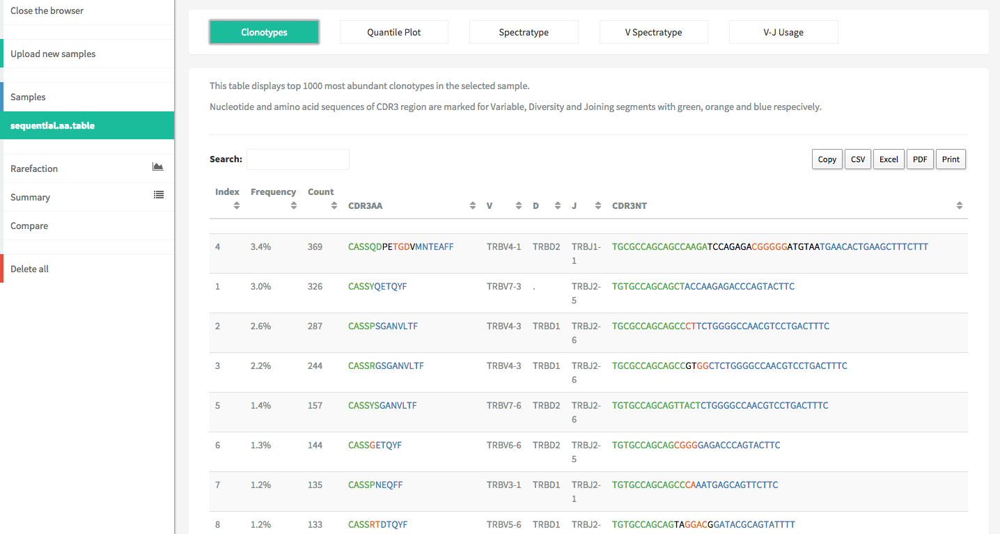
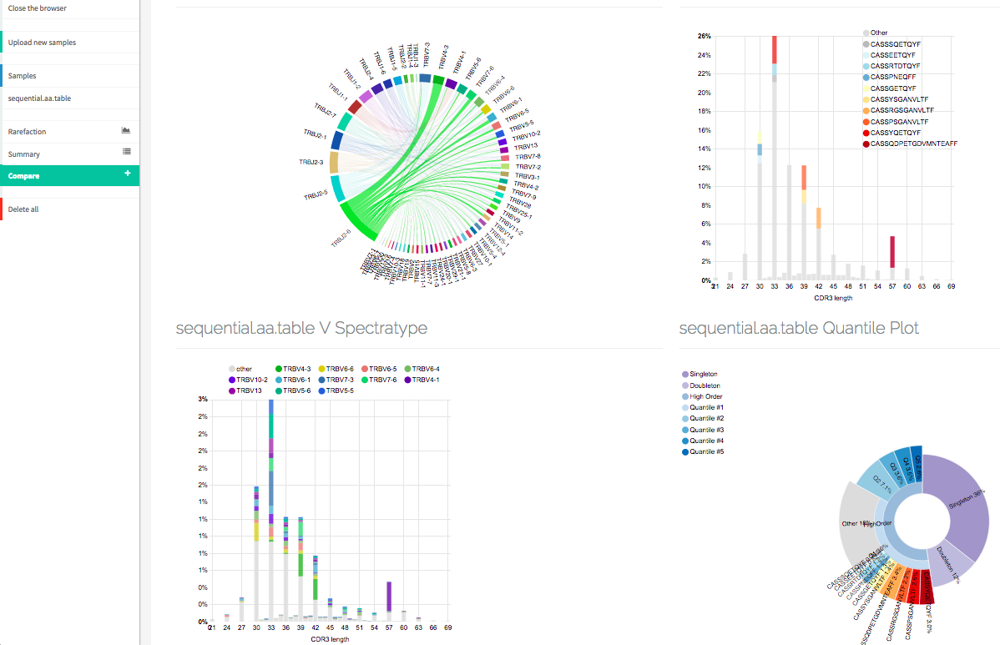

.. _vdjviz:

Clonotype browser
-----------------

In order to demonstrate VDJtools API features, a lightweight immune
repertoire browser **VDJviz** was implemented by
`@bvdmitri <https://github.com/bvdmitri>`__. VDJviz is a 
`Play framework <https://www.playframework.com/>`__
application that uses `D3js <http://d3js.org/>`__ for interactive
visualization of VDJtools output. It allows visualizing and
comparing various immune repertoire features such as spectratypes and
rarefaction curves. 

To try it out register at
`vdjviz.milaboratory.com <http://vdjviz.milaboratory.com/>`__ and upload
some RepSeq files in any supported format.

.. important::
    Currently there is an upload limit of 25 files with at
    most 10,000 clonotypes, so the :ref:`DownSample` routine
    could come in handy

    
    Clonotype browser panel
    

    
    Interactive graphs
